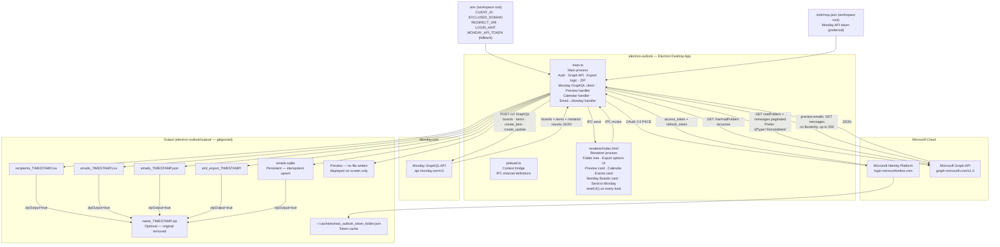
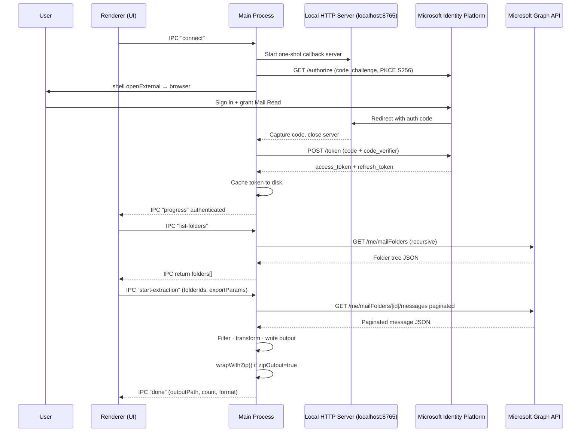
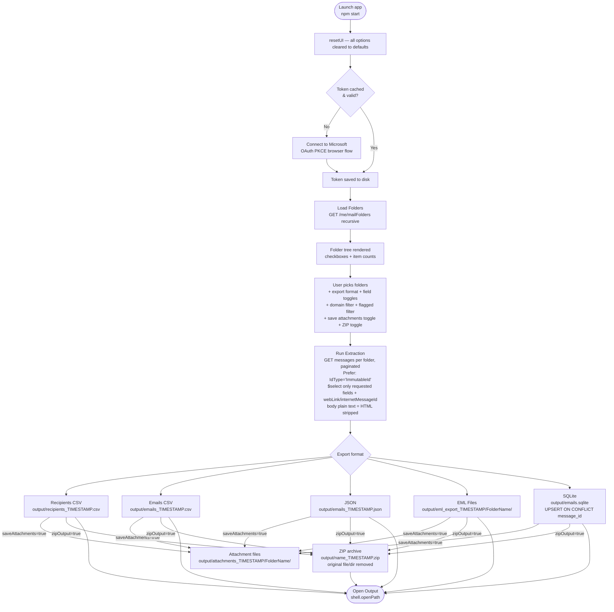
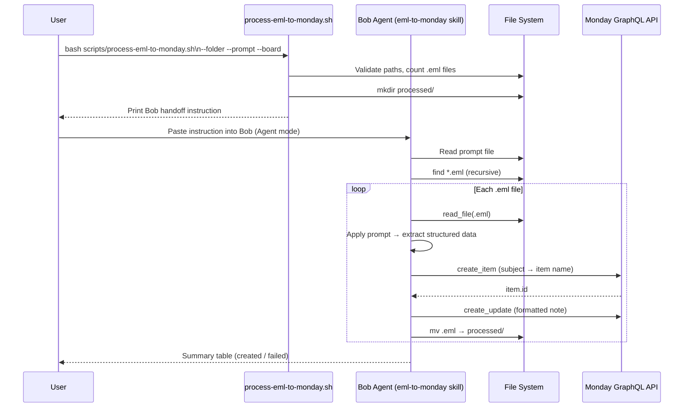

# Architecture — Outlook Folder Extractor

## Application Overview 

The **Electron Folder Extractor** is a native desktop app that authenticates against
Microsoft Identity Platform via OAuth 2.0 Authorization Code + PKCE, fetches your
mailbox folder tree through the Microsoft Graph API, and exports selected emails in
one of six formats — all without storing any password.

The app also integrates with **Monday.com**: a dedicated card lets you view all your
Monday boards (name, workspace, item count, state) by calling the Monday GraphQL API
directly from the main process using the token stored in `.bob/mcp.json`.

A dedicated **Preview** format lets you browse emails directly on-screen (up to 200) without
writing any file — messages appear in a scrollable list with a reading pane and live search.

A **Calendar Events** card lets you browse your Microsoft 365 calendar events (from today,
up to 6 months ahead), grouped by day, with a detail pane per event and CSV export of
selected events. This feature requires the `Calendars.Read` delegated permission to be
declared in the Azure App Registration — see [Calendar Access Requirement](#calendar-access-requirement) below.

The **Output Destination** card lets users choose where extracted files go:
- 💻 **Local only** (default) — saved to `electron-outlook/output/`
- ☁️ **Box only** — uploaded to IBM Enterprise Box (`ibm.ent.box.com`) via OAuth 2.0
- 🔵 **OneDrive only** — uploaded to the user's OneDrive via Microsoft Graph API (reuses existing Microsoft token)
- 💻+☁️ **Both (Box)** — saved locally and uploaded to Box
- 💻+🔵 **Both (OneDrive)** — saved locally and uploaded to OneDrive

Box authentication uses a dedicated OAuth 2.0 Authorization Code flow (no PKCE — Box standard),
separate from the Microsoft token, cached at `~/.cache/extract_box_token.json`.
The Box app (`BOX_CLIENT_ID` / `BOX_CLIENT_SECRET`) must be enabled by an IBM Box admin
before the Connect to Box button will succeed.

All UI state (format selection, field toggles, filters, date, ZIP option) is reset
to defined defaults on every app launch via an explicit `resetUI()` call in the boot
sequence — no state is persisted between sessions. Box connection state is preserved.



---

## Authentication Flow (OAuth 2.0 Authorization Code + PKCE)



---

## Extraction & Export Flow



---

## IPC Channel Map

| Channel | Direction | Payload | Description |
|---|---|---|---|
| `get-status` | renderer → main | — | Check if a valid Microsoft token exists |
| `connect` | renderer → main | — | Start Microsoft interactive OAuth PKCE flow |
| `list-folders` | renderer → main | — | Fetch full folder tree recursively |
| `list-calendars` | renderer → main | — | List user's Microsoft 365 calendars via `GET /me/calendars` |
| `fetch-calendar-events` | renderer → main | `since?, limit?` | Fetch calendar events via `GET /me/calendarView` — requires `Calendars.Read` in Azure App Registration |
| `start-extraction` | renderer → main | `folderIds, folderTree, since?, exportParams` | Run export to file |
| `preview-emails` | renderer → main | `folderIds, folderTree, since?, limit?, flaggedOnly?` | Fetch messages for on-screen display (no file written) |
| `download-selected-emails` | renderer → main | `messages: PreviewMessage[]` | Save selected preview emails as `.eml` files to `output/preview_download_TIMESTAMP/` |
| `open-file` | renderer → main | `path` | Open file/folder with OS default app |
| `list-monday-boards` | renderer → main | — | Fetch all Monday boards via GraphQL API |
| `get-monday-board-items` | renderer → main | `boardId` | Fetch up to 200 items for a board |
| `create-monday-item` | renderer → main | `boardId, itemName` | Create a new item on a Monday board |
| `add-monday-item-update` | renderer → main | `itemId, body` | Post a text update note on a Monday item |
| `show-open-dialog` | renderer → main | `title, properties, filters?` | Open native OS file / folder picker dialog |
| `process-eml-folder` | renderer → main | `folderPath, promptContent, boardId` | Process `.eml` folder: parse emails, create Monday items, move files to `processed/` |
| `list-bob-skills` | renderer → main | — | List all Bob skills in `.bob/skills/` — returns `{ name, path }[]`; used to populate the 🧠 Skill dropdown in EML Triage |
| `connect-box` | renderer → main | — | Start Box OAuth 2.0 browser login flow |
| `box-logout` | renderer → main | — | Clear Box token cache |
| `get-box-status` | renderer → main | — | Check if a valid Box token exists |
| `list-box-folders` | renderer → main | — | List root-level Box folders |
| `upload-to-box` | renderer → main | `localPath, boxFolderId, newFolderName?` | Upload exported file to Box folder |
| `get-boxdrive-status` | renderer → main | — | Detect Box Drive mount point on local filesystem |
| `list-boxdrive-folders` | renderer → main | — | List top-level folders inside the Box Drive mount |
| `copy-to-boxdrive` | renderer → main | `localPath, destFolderPath?, newFolderName?` | Copy exported file to Box Drive folder via `fs.copyFileSync` |
| `get-onedrive-status` | renderer → main | — | Check if a valid Microsoft token exists (reused for OneDrive) |
| `list-onedrive-folders` | renderer → main | — | List top-level OneDrive folders via Graph API |
| `upload-to-onedrive` | renderer → main | `localPath, oneDriveFolderId, newFolderName?` | Upload exported file to OneDrive (chunked for large files) |
| `progress` | main → renderer | `{ message }` | Live status updates during extraction |
| `done` | main → renderer | `{ outputPath, count, format }` | Extraction complete |
| `error` | main → renderer | `{ message }` | Error notification |
| `read-file` | renderer → main | `path` | Read a local file from disk (used by prompt editor modal) |
| `write-file` | renderer → main | `path, content` | Write a local file to disk (used by prompt editor modal save) |
| `monday-error` | main → renderer | `{ message }` | Monday API error notification |
| `eml-triage-progress` | main → renderer | `{ message }` | Live progress updates during EML folder triage |

---

## Calendar Access Requirement

The **Calendar Events** feature calls `GET /me/calendarView` on the Microsoft Graph API.
This endpoint requires the `Calendars.Read` **delegated** permission.

### Why corporate M365 tenants block it

Microsoft Entra ID (Azure AD) enforces that any scope requested at runtime must be
**pre-declared** in the Azure App Registration's API permissions list. If `Calendars.Read`
is not declared, corporate tenants reject the request and display an "admin approval
required" screen — even though the delegated version of this permission does **not**
actually require admin consent.

### Permission reference

| Permission | Type | Admin consent required |
|---|---|---|
| `Calendars.Read` (Application) | App-only, no sign-in | **Yes** |
| `Calendars.Read` (Delegated) | User signs in interactively | **No** |

This app uses **delegated** permissions (user signs in via PKCE) — so no admin consent
is needed. The only requirement is that `Calendars.Read` is listed in the app registration.

### How to enable it

1. Go to [portal.azure.com](https://portal.azure.com) → **Entra ID → App registrations**
2. Search for App ID: `14d82eec-204b-4c2f-b7e8-296a70dab67e`
3. **API permissions → Add a permission → Microsoft Graph → Delegated permissions**
4. Search for and select **`Calendars.Read`** → click **Add permissions**
5. Re-authenticate once in the app (Reconnect, or delete `~/.cache/extract_outlook_token_folder.json`)

> Only the **owner of the app registration** needs to do this — not a tenant IT admin.
> All email features work normally without this step.

### Behaviour when not enabled

When `Calendars.Read` is not declared, clicking **📅 Load Calendar** returns a 403 from
the Graph API. The app catches this and shows a clear actionable message in the Progress
log — authentication is not disrupted and all email features continue to work normally.

---

## Monday.com Integration

### Email → Monday (Send to Monday)

Emails browsed in **Preview** mode can be pushed directly to a Monday board as items from the selection action bar.

**Flow:**
1. User clicks **📋 View My Boards** — boards are fetched and the board picker in the email selection bar is populated.
2. User switches to **Preview** format and loads emails.
3. User checks one or more emails — the selection bar becomes visible.
4. User picks a target board from the dropdown and clicks **📋 Send to Monday**.
5. For each selected email:
   - `create-monday-item` IPC → `create_item` GraphQL mutation → item name = email subject
   - `add-monday-item-update` IPC → `create_update` GraphQL mutation → body = full plain-text email body
6. Inline status shown: progress → ✅ summary or ❌ error

| Email field | Monday destination | GraphQL mutation |
|---|---|---|
| Subject | Item name | `create_item(board_id, item_name)` |
| Body (plain text) | Item update note | `create_update(item_id, body)` |

> The board picker is only populated after the user explicitly clicks **📋 View My Boards** — no auto-fetch is performed.

### Token resolution

At startup, `main.ts` resolves the Monday API token using the following priority order
(first non-empty value wins):

| Priority | Source | How to set |
|---|---|---|
| **1st — preferred** | `.bob/mcp.json` `mcpServers.monday.headers.Authorization` | Bob MCP server config (§ 3 of Quickstart) |
| **2nd — fallback** | `MONDAY_API_TOKEN` environment variable | `.env` file at workspace root |

The `.bob/mcp.json` candidate paths tried in order:

1. `<__dirname>/../../../.bob/mcp.json` ← dev (source) layout
2. `<__dirname>/../../.bob/mcp.json` ← alternative dev layout
3. `<process.resourcesPath>/.bob/mcp.json` ← packaged app layout
4. `<process.cwd()}/.bob/mcp.json` ← launch scripts / app dir working directory
5. `<process.cwd()}/../.bob/mcp.json` ← workspace root when launched from `electron-outlook`

The `.env` candidate paths include both the app directory and workspace-root layouts so
launcher scripts and manual `npm start` resolve the same Monday credentials.

If neither source provides a token, `MONDAY_API_TOKEN` is `null` and `mondayGraphQL()`
rejects with an error sent via the `monday-error` IPC channel to the renderer.

Both sources produce **identical runtime behaviour** — all Monday features (View Boards,
board items, Send to Monday / create item + update) work the same way regardless of
which source provides the token.

### GraphQL query

```graphql
{
  boards(limit: 100, order_by: used_at) {
    id
    name
    description
    board_kind
    state
    items_count
    workspace { id name }
  }
}
```

### `MondayItemUpdate` mutation

```graphql
mutation {
  create_update(item_id: <itemId>, body: "<escaped body>") {
    id
  }
}
```

### `MondayBoard` type (preload / renderer)

```typescript
interface MondayBoard {
  id:          string;
  name:        string;
  description: string | null;
  board_kind:  string;   // "public" | "private" | "share"
  state:       string;   // "active" | "archived" | "deleted"
  items_count: number;
  workspace:   { id: string; name: string } | null;
  columns:     Array<{ id: string; title: string; type: string }>;  // board column metadata
}
```

---

## Preview — Design Notes

| Detail | Value |
|---|---|
| IPC channel | `preview-emails` |
| Graph `$select` | `id, sentDateTime, from, toRecipients, ccRecipients, subject, body, hasAttachments, flag, isRead, importance` |
| `$orderby` | **None** — omitted to avoid Graph API rejection when `body` is in `$select` |
| Limit | Configurable — 50 / 100 / 200 (default 100) |
| File output | **None** — messages are returned as JSON to the renderer and rendered in-memory |
| Reading pane | Plain text only (`bodyText` with HTML stripped) |
| Live search | Filters by subject, sender name/address, body text |
| Badges | 🚩 flagged · 📎 has attachments · ❗ high importance |
| Unread styling | Bold subject line |

---

## Export Params Schema

```typescript
interface ExportParams {
  exportFormat:           "recipients-csv" | "emails-csv" | "eml" | "json" | "sqlite";
  includeFrom:            boolean;
  includeToCC:            boolean;
  includeSubject:         boolean;
  includeBodyText:        boolean;   // strips HTML tags automatically when body is HTML
  includeBodyHtml:        boolean;   // raw HTML content
  includeAttachmentsMeta: boolean;
  filterExcludedDomain:   boolean;
  excludedDomain:         string;    // e.g. ".ibm.com" — editable in the UI
  flaggedOnly:            boolean;   // skip messages whose flag.flagStatus ≠ "flagged"
  saveAttachments:        boolean;   // save binary attachment files alongside primary export
  attachmentTypes:        string[];  // [] = all; else subset of "pdf"|"docx"|"pptx"|"xlsx"|"images"
  zipOutput:              boolean;   // compress primary export into .zip; original removed
}
```

> **Body text:** Microsoft Graph always returns HTML. `includeBodyText` automatically
> strips HTML tags to produce readable plain text — both `bodyText` and `bodyHtml`
> always contain content when their respective toggle is on.

---

## ZIP Export — Design

`wrapWithZip(sourcePath, onProgress)` is called in the `start-extraction` handler after
any format produces a non-empty result, when `exportParams.zipOutput === true`.

| Detail | Value |
|---|---|
| Library | `archiver` v8 (`ZipArchive` class — pure JS, no native rebuild) |
| Compression level | zlib level 9 |
| Output naming | `<original-basename>_<timestamp>.zip` (timestamped, no overwrites) |
| Files vs directories | `archive.file()` for single files; `archive.directory()` for EML directory trees |
| Cleanup | Original file/directory removed after the `close` event fires |

---

## SQLite Export — Idempotency Design

| Decision | Rationale |
|---|---|
| `message_id TEXT PRIMARY KEY` | Immutable Graph message ID requested with `Prefer: IdType="ImmutableId"` |
| `INSERT … ON CONFLICT DO UPDATE` | Upsert — re-running never adds duplicates |
| `exported_at TEXT` | ISO-8601 timestamp of last upsert |
| WAL journal mode | Safe for concurrent reads while writing |
| Per-folder batched transactions | Orders of magnitude faster than one transaction per row |

### SQLite table schema

```sql
CREATE TABLE IF NOT EXISTS emails (
  message_id           TEXT PRIMARY KEY,
  export_id            TEXT,
  internet_message_id  TEXT,
  outlook_web_link     TEXT,
  sent_datetime        TEXT,
  folder               TEXT,
  from_email           TEXT,
  from_name            TEXT,
  to_recipients        TEXT,
  cc_recipients        TEXT,
  subject              TEXT,
  body_text            TEXT,
  body_html            TEXT,
  attachments          TEXT,   -- JSON string of attachment metadata
  exported_at          TEXT    -- ISO-8601 timestamp of last upsert
);
```

---

## Attachment type → file extension mapping

| UI label | Matched extensions |
|---|---|
| **All types** | _(every extension)_ |
| **PDF** | `.pdf` |
| **Word** | `.doc` `.docx` `.dot` `.dotx` `.odt` |
| **PowerPoint** | `.ppt` `.pptx` `.pot` `.potx` `.pps` `.ppsx` `.odp` |
| **Excel** | `.xls` `.xlsx` `.xlsm` `.xlt` `.xltx` `.ods` `.csv` |
| **Images** | `.jpg` `.jpeg` `.png` `.gif` `.bmp` `.webp` `.tiff` `.tif` `.svg` `.heic` `.heif` |

---

## Graph API — Attachments Download Strategy

When `saveAttachments = true`, the main process makes two Graph calls per message that has attachments:

1. **`GET /me/messages/{id}/attachments?$select=id,name,contentType,@microsoft.graph.downloadUrl`**  
   Returns the attachment list. `fileAttachment` items include `contentBytes` (base64) inline.

2. **`GET /me/messages/{id}/attachments/{attId}/$value`**  
   Used as a fallback when `contentBytes` is absent (large files, `itemAttachment` sub-items).

Files are written to `output/attachments_TIMESTAMP/<FolderName>/<filename>`.
Duplicate filenames within the same folder are disambiguated by appending `_1`, `_2`, … before the extension.

---

## EML → Monday Triage

Exported `.eml` files can be triaged in two ways.

### Option A — Built-in App Card

The **EML → Monday Triage** card is built into the app window (below the Monday Items card).
It processes `.eml` files entirely inside the Electron main process — no Bob or external agent needed.

**Flow:**
1. User picks an EML folder via native OS dialog (`show-open-dialog`)
2. User picks a prompt file (`.md` / `.txt`) via native OS dialog — or selects a Bob skill from the **🧠 Skill** dropdown (populated via `list-bob-skills` IPC)
   - If a file is selected, ✏️ / 👁 buttons appear: clicking either opens the **Prompt Editor Modal** (see below)
3. User enters the Monday board ID (visible in the Boards list as `ID: …`)
4. User clicks **▶ Run Triage** — for each `.eml` file:
   - `parseEmlHeaders()` extracts Subject, From, Date
   - `parseEmlBody()` / `stripHtml()` extracts plain-text body
   - Rule-based urgency (🔴/🟡/🟢) and category inferred from keywords
   - `create_item` GraphQL mutation → item name = subject
   - `create_update` GraphQL mutation → formatted note with all extracted fields
   - `fs.renameSync()` moves processed file to `<folder>/processed/`
5. `eml-triage-progress` IPC events stream live log lines to the renderer
6. Final `process-eml-folder` response returns results array for the summary table

| Extracted field | Monday destination |
|---|---|
| Subject | Item name (`create_item`) |
| From · Date · Urgency · Category · Summary | Formatted update note (`create_update`) |
| Prompt file content (first 500 chars) | Embedded in update note for traceability |
| Source filename | Embedded in update note |

### Option B — Bob Agent workflow

A companion workflow lets **Bob** (AI agent) process exported `.eml` files using a local
prompt file, create Monday items, and move processed files to a `processed/` subfolder.



### Prompt file location

```
prompts/                  ← gitignored — stays local
└── email-triage.md       ← default triage template (editable)
```

### Bob Skill

```
.bob/skills/
└── eml-to-monday.md      ← auto-activated when user asks to process .eml files
```

---

## Prompt Editor Modal

An in-app overlay modal (dark backdrop + centred card) for editing and previewing prompt/skill files without leaving the app.

| Detail | Value |
|---|---|
| Trigger | ✏️ (Edit) or 👁 (Preview) button — visible only when a prompt file is selected |
| IPC reads | `read-file` — loads file content into the textarea |
| IPC writes | `write-file` — saves textarea content back to disk |
| Markdown renderer | `marked.js` (bundled as `renderer/marked.min.js`) |
| Tabs | **✏️ Edit** (textarea) · **👁 Preview** (rendered HTML) |
| Save | Calls `write-file`; shows inline success/error; closes on success |
| Cancel / backdrop click | Closes without saving |
| Height | Fixed `80vh`; body pane scrolls independently |

## 🧠 Skill Selector

The EML Triage card includes a **🧠 Skill** dropdown populated at startup by `list-bob-skills`.

| Detail | Value |
|---|---|
| IPC channel | `list-bob-skills` |
| Source | All `.md` files + `SKILL.md` inside sub-folders under `.bob/skills/` |
| Default option | `— use prompt file above —` (no override) |
| Override behaviour | Selecting a skill sets `_emlPromptPath` to the skill file path, overriding any manually browsed prompt file |
| Fallback | If `.bob/skills/` is inaccessible the dropdown remains empty and triage uses the manually selected file |

---

## Project Structure

```
Outlook-Bob/
├── .env.example                          # Config template → copy to .env
├── .env                                  # Your secrets (gitignored)
├── .bob/
│   ├── mcp.json                          # MCP server config — Monday API token lives here
│   └── skills/
│       └── eml-to-monday.md              # Bob skill — EML → Monday triage workflow
├── .gitignore
├── README.md
├── prompts/                              # Local prompt files — gitignored
│   └── email-triage.md                   # Default email triage extraction prompt
├── Docs/
│   ├── Architecture.md                   # This file
│   └── Quickstart.md                     # Setup & usage guide
├── scripts/
│   ├── start-electron-outlook.sh         # Build + launch (macOS / Linux)
│   ├── stop-electron-outlook.sh          # Stop gracefully (macOS / Linux)
│   ├── start-electron-outlook.ps1        # Build + launch (Windows)
│   ├── stop-electron-outlook.ps1         # Stop gracefully (Windows)
│   └── process-eml-to-monday.sh          # Pre-flight helper — EML → Monday triage
└── electron-outlook/
    ├── src/
    │   ├── main.ts                        # Main process — auth, Graph API, export logic, ZIP, Monday GraphQL client, preview handler
    │   ├── preload.ts                     # Context bridge — IPC channels + types (MondayBoard, PreviewMessage)
    │   └── renderer/
    │       ├── index.html                 # Full UI — folder tree, export formats, preview card, Monday Boards card, EML Triage card, Prompt Editor Modal, resetUI()
    │       └── marked.min.js              # Bundled markdown renderer used by the Prompt Editor Modal
    ├── package.json
    ├── tsconfig.json
    ├── Quickstart.md                      # App-specific quickstart
    └── output/                            # Generated exports (gitignored)
```
