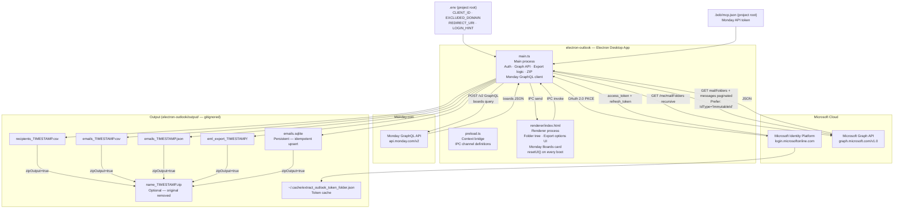
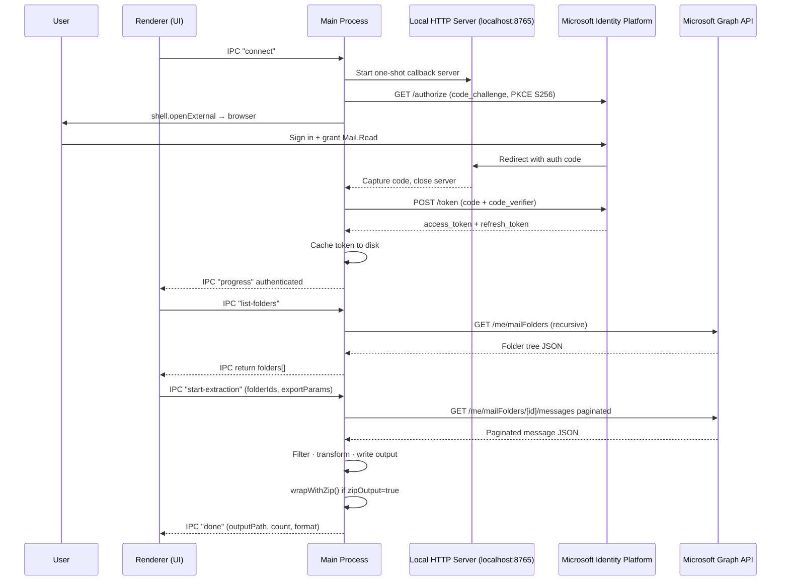

# Architecture — Outlook Folder Extractor

## Application Overview

The **Electron Folder Extractor** is a native desktop app that authenticates against
Microsoft Identity Platform via OAuth 2.0 Authorization Code + PKCE, fetches your
mailbox folder tree through the Microsoft Graph API, and exports selected emails in
one of five formats — all without storing any password.

The app also integrates with **Monday.com**: a dedicated card lets you view all your
Monday boards (name, workspace, item count, state) by calling the Monday GraphQL API
directly from the main process using the token stored in `.bob/mcp.json`.

All UI state (format selection, field toggles, filters, date, ZIP option) is reset
to defined defaults on every app launch via an explicit `resetUI()` call in the boot
sequence — no state is persisted between sessions.



---

## Authentication Flow (OAuth 2.0 Authorization Code + PKCE)



---

## Extraction & Export Flow


---

## IPC Channel Map

| Channel | Direction | Payload | Description |
|---|---|---|---|
| `get-status` | renderer → main | — | Check if a valid token exists |
| `connect` | renderer → main | — | Start interactive OAuth flow |
| `list-folders` | renderer → main | — | Fetch full folder tree recursively |
| `start-extraction` | renderer → main | `folderIds, folderTree, since?, exportParams` | Run export |
| `open-file` | renderer → main | `path` | Open file/folder with OS default app |
| `list-monday-boards` | renderer → main | — | Fetch all Monday boards via GraphQL API |
| `progress` | main → renderer | `{ message }` | Live status updates |
| `done` | main → renderer | `{ outputPath, count, format }` | Extraction complete |
| `error` | main → renderer | `{ message }` | Error notification |
| `monday-error` | main → renderer | `{ message }` | Monday API error notification |

---

## Monday.com Integration

### Token resolution

At startup, `main.ts` scans three candidate paths for `.bob/mcp.json` and extracts
`mcpServers.monday.headers.Authorization`. The first match wins:

1. `<__dirname>/../../../.bob/mcp.json` ← dev (source) layout
2. `<__dirname>/../../.bob/mcp.json` ← alternative dev layout
3. `<process.resourcesPath>/.bob/mcp.json` ← packaged app layout

If no token is found, `MONDAY_API_TOKEN` is `null` and the IPC handler returns an error
sent via the `monday-error` channel.

### GraphQL query

```graphql
{
  boards(limit: 100, order_by: used_at) {
    id
    name
    description
    board_kind
    state
    items_count
    workspace { id name }
  }
}
```

### `MondayBoard` type (preload / renderer)

```typescript
interface MondayBoard {
  id:          string;
  name:        string;
  description: string | null;
  board_kind:  string;   // "public" | "private" | "share"
  state:       string;   // "active" | "archived" | "deleted"
  items_count: number;
  workspace:   { id: string; name: string } | null;
}
```

---

## Export Params Schema

```typescript
interface ExportParams {
  exportFormat:           "recipients-csv" | "emails-csv" | "eml" | "json" | "sqlite";
  includeFrom:            boolean;
  includeToCC:            boolean;
  includeSubject:         boolean;
  includeBodyText:        boolean;   // strips HTML tags automatically when body is HTML
  includeBodyHtml:        boolean;   // raw HTML content
  includeAttachmentsMeta: boolean;
  filterExcludedDomain:   boolean;
  excludedDomain:         string;    // e.g. ".ibm.com" — editable in the UI
  flaggedOnly:            boolean;   // skip messages whose flag.flagStatus ≠ "flagged"
  saveAttachments:        boolean;   // save binary attachment files alongside primary export
  attachmentTypes:        string[];  // [] = all; else subset of "pdf"|"docx"|"pptx"|"xlsx"|"images"
  zipOutput:              boolean;   // compress primary export into .zip; original removed
}
```

> **Body text:** Microsoft Graph always returns HTML. `includeBodyText` automatically
> strips HTML tags to produce readable plain text — both `bodyText` and `bodyHtml`
> always contain content when their respective toggle is on.

---

## ZIP Export — Design

`wrapWithZip(sourcePath, onProgress)` is called in the `start-extraction` handler after
any format produces a non-empty result, when `exportParams.zipOutput === true`.

| Detail | Value |
|---|---|
| Library | `archiver` v8 (`ZipArchive` class — pure JS, no native rebuild) |
| Compression level | zlib level 9 |
| Output naming | `<original-basename>_<timestamp>.zip` (timestamped, no overwrites) |
| Files vs directories | `archive.file()` for single files; `archive.directory()` for EML directory trees |
| Cleanup | Original file/directory removed after the `close` event fires |

---

## SQLite Export — Idempotency Design

| Decision | Rationale |
|---|---|
| `message_id TEXT PRIMARY KEY` | Immutable Graph message ID requested with `Prefer: IdType="ImmutableId"` |
| `INSERT … ON CONFLICT DO UPDATE` | Upsert — re-running never adds duplicates |
| `exported_at TEXT` | ISO-8601 timestamp of last upsert |
| WAL journal mode | Safe for concurrent reads while writing |
| Per-folder batched transactions | Orders of magnitude faster than one transaction per row |

### SQLite table schema

```sql
CREATE TABLE IF NOT EXISTS emails (
  message_id           TEXT PRIMARY KEY,
  export_id            TEXT,
  internet_message_id  TEXT,
  outlook_web_link     TEXT,
  sent_datetime        TEXT,
  folder               TEXT,
  from_email           TEXT,
  from_name            TEXT,
  to_recipients        TEXT,
  cc_recipients        TEXT,
  subject              TEXT,
  body_text            TEXT,
  body_html            TEXT,
  attachments          TEXT,   -- JSON string of attachment metadata
  exported_at          TEXT    -- ISO-8601 timestamp of last upsert
);
```

---

## Attachment type → file extension mapping

| UI label | Matched extensions |
|---|---|
| **All types** | _(every extension)_ |
| **PDF** | `.pdf` |
| **Word** | `.doc` `.docx` `.dot` `.dotx` `.odt` |
| **PowerPoint** | `.ppt` `.pptx` `.pot` `.potx` `.pps` `.ppsx` `.odp` |
| **Excel** | `.xls` `.xlsx` `.xlsm` `.xlt` `.xltx` `.ods` `.csv` |
| **Images** | `.jpg` `.jpeg` `.png` `.gif` `.bmp` `.webp` `.tiff` `.tif` `.svg` `.heic` `.heif` |

---

## Graph API — Attachments Download Strategy

When `saveAttachments = true`, the main process makes two Graph calls per message that has attachments:

1. **`GET /me/messages/{id}/attachments?$select=id,name,contentType,@microsoft.graph.downloadUrl`**  
   Returns the attachment list. `fileAttachment` items include `contentBytes` (base64) inline.

2. **`GET /me/messages/{id}/attachments/{attId}/$value`**  
   Used as a fallback when `contentBytes` is absent (large files, `itemAttachment` sub-items).

Files are written to `output/attachments_TIMESTAMP/<FolderName>/<filename>`.
Duplicate filenames within the same folder are disambiguated by appending `_1`, `_2`, … before the extension.

---

## Project Structure

```
Outlook-Bob/
├── .env.example                          # Config template → copy to .env
├── .env                                  # Your secrets (gitignored)
├── .bob/
│   └── mcp.json                          # MCP server config — Monday API token lives here
├── .gitignore
├── README.md
├── Docs/
│   ├── Architecture.md                   # This file
│   └── Quickstart.md                     # Setup & usage guide
├── scripts/
│   ├── start-electron-outlook.sh         # Build + launch (macOS / Linux)
│   ├── stop-electron-outlook.sh          # Stop gracefully (macOS / Linux)
│   ├── start-electron-outlook.ps1        # Build + launch (Windows)
│   └── stop-electron-outlook.ps1         # Stop gracefully (Windows)
└── electron-outlook/
    ├── src/
    │   ├── main.ts                        # Main process — auth, Graph API, export logic, ZIP, Monday GraphQL client
    │   ├── preload.ts                     # Context bridge — IPC channel definitions + types (incl. MondayBoard)
    │   └── renderer/
    │       └── index.html                 # Full UI — folder tree, export options, Monday Boards card, resetUI()
    ├── package.json
    ├── tsconfig.json
    ├── Quickstart.md                      # App-specific quickstart
    └── output/                            # Generated exports (gitignored)
```
