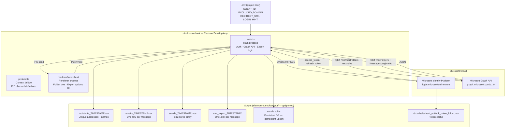
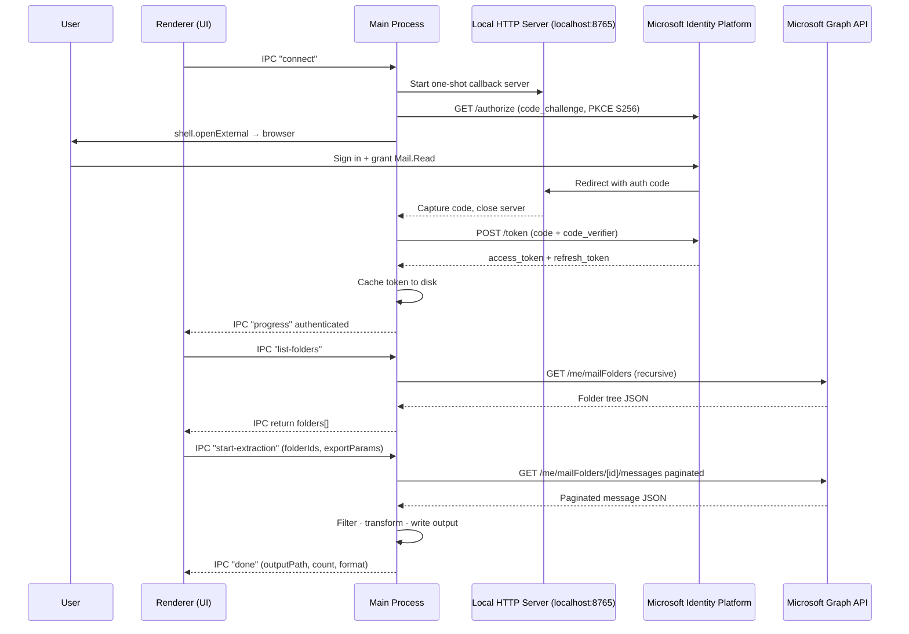
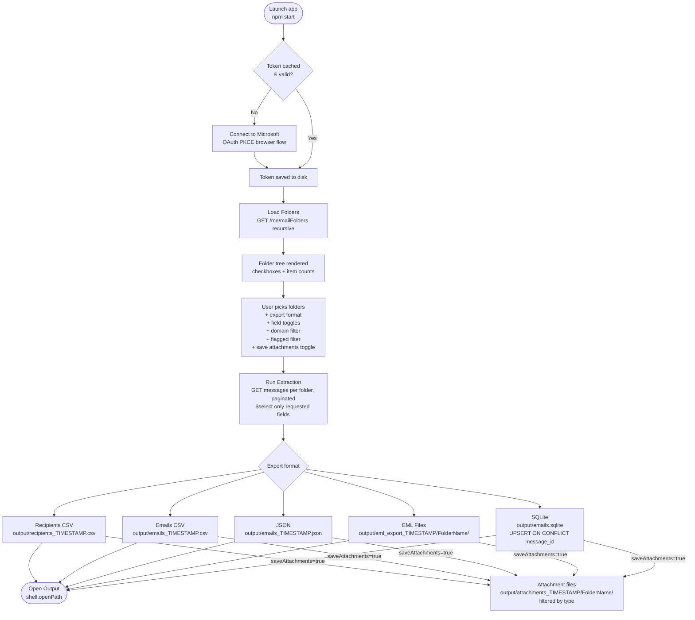

# Architecture — Outlook Folder Extractor

## Application Overview

The **Electron Folder Extractor** is a native desktop app that authenticates against
Microsoft Identity Platform via OAuth 2.0 Authorization Code + PKCE, fetches your
mailbox folder tree through the Microsoft Graph API, and exports selected emails in
one of five formats — all without storing any password.



---

## Authentication Flow (OAuth 2.0 Authorization Code + PKCE)



---

## Extraction & Export Flow



---

## IPC Channel Map

| Channel | Direction | Payload | Description |
|---|---|---|---|
| `get-status` | renderer → main | — | Check if a valid token exists |
| `connect` | renderer → main | — | Start interactive OAuth flow |
| `list-folders` | renderer → main | — | Fetch full folder tree recursively |
| `start-extraction` | renderer → main | `folderIds, folderTree, since?, exportParams` | Run export |
| `open-file` | renderer → main | `path` | Open file/folder with OS default app |
| `progress` | main → renderer | `{ message }` | Live status updates |
| `done` | main → renderer | `{ outputPath, count, format }` | Extraction complete |
| `error` | main → renderer | `{ message }` | Error notification |

---

## Export Params Schema

```typescript
interface ExportParams {
  exportFormat:           "recipients-csv" | "emails-csv" | "eml" | "json" | "sqlite";
  includeFrom:            boolean;
  includeToCC:            boolean;
  includeSubject:         boolean;
  includeBodyText:        boolean;
  includeBodyHtml:        boolean;
  includeAttachmentsMeta: boolean;
  filterExcludedDomain:   boolean;
  excludedDomain:         string;   // e.g. ".ibm.com" — editable in the UI
  flaggedOnly:            boolean;  // when true, skip messages whose flag.flagStatus ≠ "flagged"
  saveAttachments:        boolean;  // when true, binary attachment files are also saved to disk
  attachmentTypes:        string[]; // [] or ["all"] = all types; else subset of:
                                    //   "pdf" | "docx" | "pptx" | "xlsx" | "images"
  // note: field toggles are ignored for "recipients-csv" format
  // note: field toggles are optional for "sqlite" (the table always has all columns)
}
```

---

## SQLite Export — Idempotency Design

The SQLite export writes to a **single, persistent file** (`output/emails.sqlite`).
Unlike the other formats it is **not timestamped**, so each run operates on the same
database, enabling incremental syncs.

Key design decisions:

| Decision | Rationale |
|---|---|
| `message_id TEXT PRIMARY KEY` | Microsoft Graph message IDs are globally unique and stable |
| `INSERT … ON CONFLICT(message_id) DO UPDATE SET …` | Upsert semantics — re-running never adds duplicates; existing rows are refreshed |
| `exported_at TEXT` | ISO-8601 timestamp recording when each row was last written |
| WAL journal mode | Safer for concurrent reads while the app is writing |
| Per-folder batched transactions | Orders-of-magnitude faster than one transaction per row |

### SQLite table schema

```sql
CREATE TABLE IF NOT EXISTS emails (
  message_id      TEXT PRIMARY KEY,
  sent_datetime   TEXT,
  folder          TEXT,
  from_email      TEXT,
  from_name       TEXT,
  to_recipients   TEXT,
  cc_recipients   TEXT,
  subject         TEXT,
  body_text       TEXT,
  body_html       TEXT,
  attachments     TEXT,   -- JSON string of attachment metadata
  exported_at     TEXT    -- ISO-8601 timestamp of last upsert
);
```

---

## Attachment type → file extension mapping

| UI label | Matched extensions |
|---|---|
| **All types** | _(every extension)_ |
| **PDF** | `.pdf` |
| **Word** | `.doc` `.docx` `.dot` `.dotx` `.odt` |
| **PowerPoint** | `.ppt` `.pptx` `.pot` `.potx` `.pps` `.ppsx` `.odp` |
| **Excel** | `.xls` `.xlsx` `.xlsm` `.xlt` `.xltx` `.ods` `.csv` |
| **Images** | `.jpg` `.jpeg` `.png` `.gif` `.bmp` `.webp` `.tiff` `.tif` `.svg` `.heic` `.heif` |

---

## Graph API — Attachments Download Strategy

When `saveAttachments = true`, the main process makes two Graph calls per message that has attachments:

1. **`GET /me/messages/{id}/attachments?$select=id,name,contentType,@microsoft.graph.downloadUrl`**
   Returns the attachment list. `fileAttachment` items include `contentBytes` (base64) inline.

2. **`GET /me/messages/{id}/attachments/{attId}/$value`**
   Used as a fallback when `contentBytes` is absent (large files, `itemAttachment` sub-items).

Files are written to `output/attachments_TIMESTAMP/<FolderName>/<filename>`.
Duplicate filenames within the same folder are disambiguated by appending `_1`, `_2`, … before the extension.

---

## Project Structure

```
Outlook-Bob/
├── .env.example                          # Config template → copy to .env
├── .env                                  # Your secrets (gitignored)
├── .gitignore
├── README.md
├── Docs/
│   ├── Architecture.md                   # This file
│   └── Quickstart.md                     # Setup & usage guide
├── scripts/
│   ├── start-electron-outlook.sh         # Build + launch (macOS / Linux)
│   ├── stop-electron-outlook.sh          # Stop gracefully (macOS / Linux)
│   ├── start-electron-outlook.ps1        # Build + launch (Windows)
│   └── stop-electron-outlook.ps1         # Stop gracefully (Windows)
└── electron-outlook/
    ├── src/
    │   ├── main.ts                        # Main process — auth, Graph API, all export logic
    │   ├── preload.ts                     # Context bridge — IPC channel definitions + types
    │   └── renderer/
    │       └── index.html                 # Full UI — folder tree, export options, progress log
    ├── package.json
    ├── tsconfig.json
    ├── Quickstart.md                      # App-specific quickstart
    └── output/                            # Generated exports (gitignored)
```
