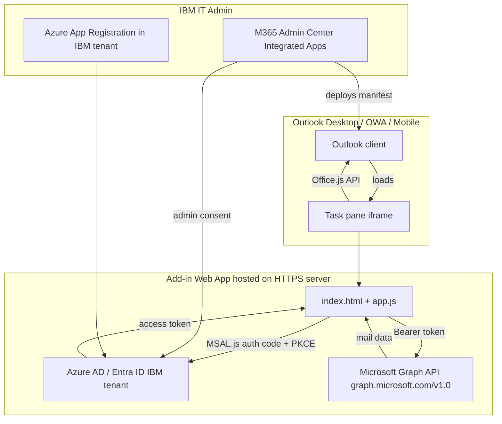

# Outlook Add-on for IBM-Managed Outlook Desktop Client

## What "add-on for Outlook desktop managed by IBM" means technically

IBM runs a **Microsoft 365 enterprise tenant** for its employees. The Outlook desktop client employees use is the standard Microsoft Outlook (Win32/macOS) provisioned through that tenant, with policies enforced via Exchange Online, InTune, and Conditional Access.

An "add-on" in this context means an **Outlook Add-in** — a web-based extension that runs inside a task pane or compose panel within the Outlook client. This is a completely different artifact from the current Electron app.

---

## Option A — Office Web Add-in (task pane) ✅ Recommended

This is the modern, Microsoft-endorsed, IBM-enterprise-compatible approach.

### How it works

### What you build

| Artifact | Description |
|---|---|
| **Web app** | HTML/CSS/JS hosted on any HTTPS server (or localhost for dev) |
| **Office.js** | Microsoft SDK — gives access to the current mail item, compose fields, etc. |
| **MSAL.js** | Microsoft auth library for token acquisition in the browser |
| **Add-in manifest** | XML or JSON file describing the add-in (name, icon, URLs, permissions) |

### What IBM IT must do

| Step | Detail |
|---|---|
| **Azure App Registration** | Create/approve an app in the IBM Entra ID (AAD) tenant with Graph API delegated permissions |
| **Admin consent** | Grant `Mail.Read`, `Mail.ReadWrite` (or whichever scopes needed) |
| **Deploy manifest** | Upload the add-in manifest via M365 Admin Center → Integrated Apps, or Exchange Admin Center → Add-ins |

### Relationship to the current Electron app

The existing [`electron-outlook`](../electron-outlook/) app already does the heavy Graph API lifting. An Outlook add-in version would essentially be a **web app port** of the same logic — same MSAL auth, same Graph endpoints, same export options — but:

- Runs **inside** Outlook instead of as a standalone window
- Uses `Office.js` to read the current mail item directly (no folder selection needed for single-email actions)
- Can pre-populate fields from the active email

---

## Option B — COM / VSTO Add-in (legacy Win32 only) ❌ Not recommended

| Aspect | Detail |
|---|---|
| **Language** | C# (.NET VSTO) or C++ |
| **Deployment** | MSI/MSIX via SCCM or InTune |
| **Scope** | Windows only — no OWA or mobile support |
| **IBM compatibility** | Requires IT packaging and push — much harder approval cycle |
| **Maintenance** | Microsoft is actively deprecating this path in favour of web add-ins |

Unless you have a specific requirement for deep Win32 Outlook object model access (e.g., reading PST files, COM automation), this path is not worth pursuing.

---

## Option C — Keep and enhance the Electron app

The current [`electron-outlook`](../electron-outlook/src/main.ts) app already works without any IBM IT involvement — it uses the public Graph Explorer `CLIENT_ID` and runs independently. If the goal is **personal/team productivity**, the Electron app is already the right tool and can be enhanced further (scheduler, AI summaries, etc.).

---

## Key constraint for IBM-managed tenants

> **Conditional Access** — IBM's M365 tenant enforces policies that can **block OAuth flows from unregistered apps**. The current Electron app uses Microsoft's public `14d82eec-204b-4c2f-b7e8-296a70dab67e` (Graph Explorer client ID). This works for personal M365 accounts but **may be blocked by IBM's Conditional Access policies** that require compliant/managed devices and registered enterprise apps.

If users in the IBM tenant hit auth failures, the fix is to register a proper Azure App in IBM's Entra ID tenant — which requires IBM IT approval.

---

## Options Comparison

| | Effort | IBM IT needed? |
|---|---|---|
| **Outlook Web Add-in** — full task pane, complete extraction UI | Medium | Yes (manifest deploy + app registration) |
| **Outlook Web Add-in** — single-email actions, dev/localhost sideload | Low | No (sideload for dev only) |
| **Electron app enhancements** — scheduler, AI features, etc. | Low–Medium | No |

---

## Next Steps

Choose one of the following directions:

1. **Build the Outlook Web Add-in** — full task pane add-in with Office.js + MSAL.js + Graph API, manifest XML, and instructions for IBM IT deployment.
2. **Enhance the Electron app** with new features (scheduler, AI summaries, etc.).
3. **Both** — a unified codebase where the web add-in and Electron app share the same Graph API layer.
