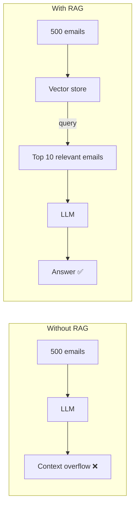
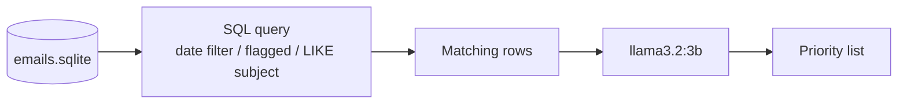
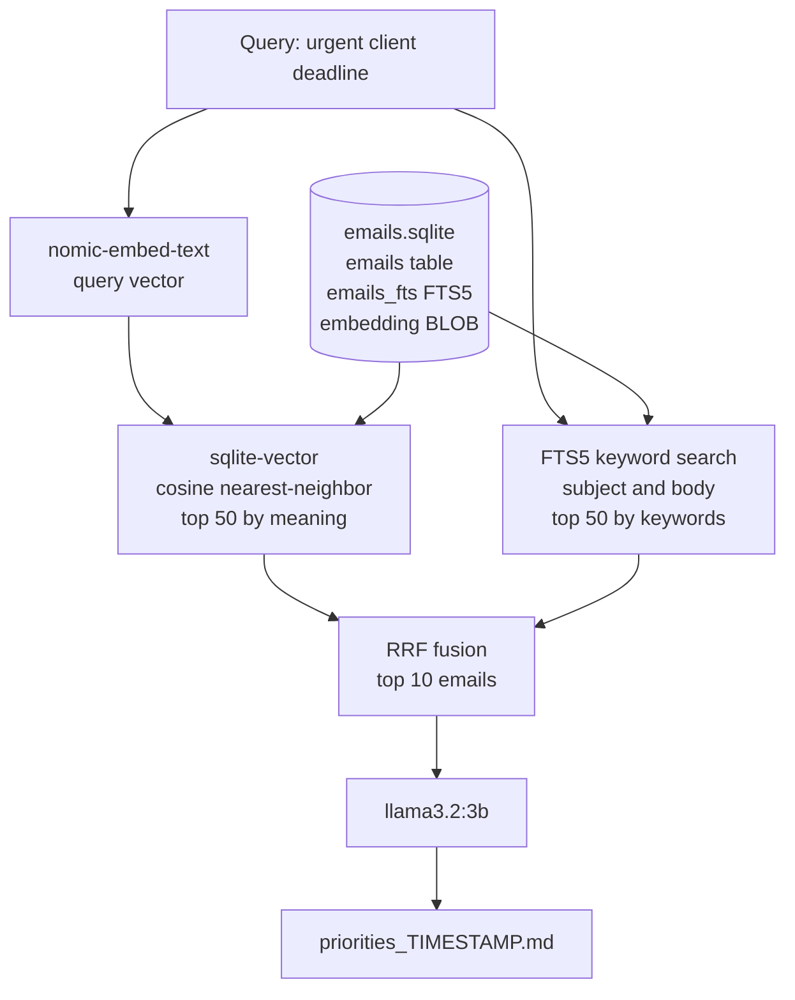
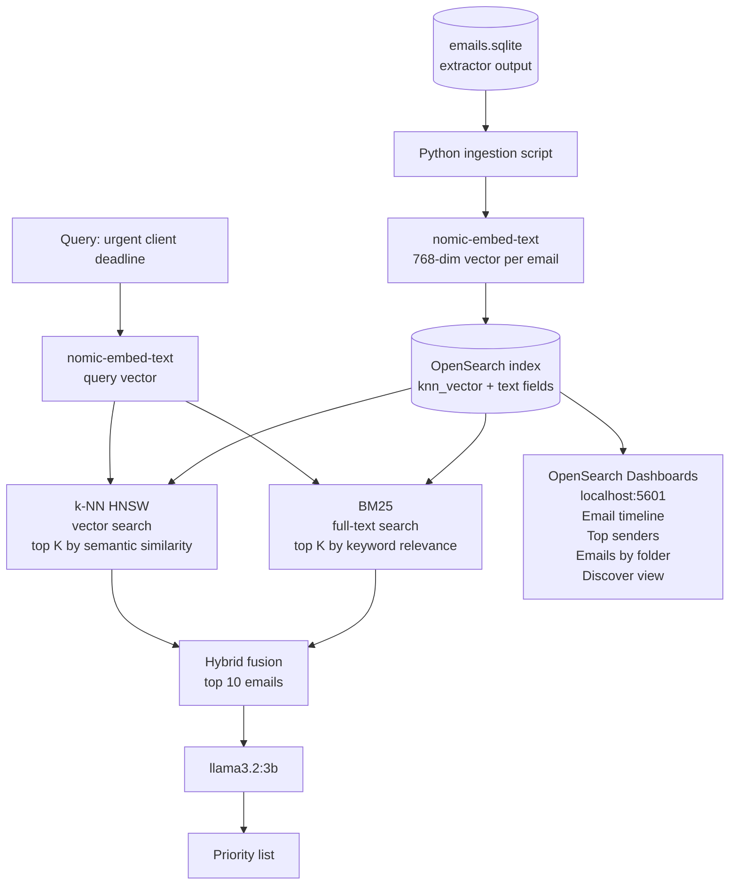
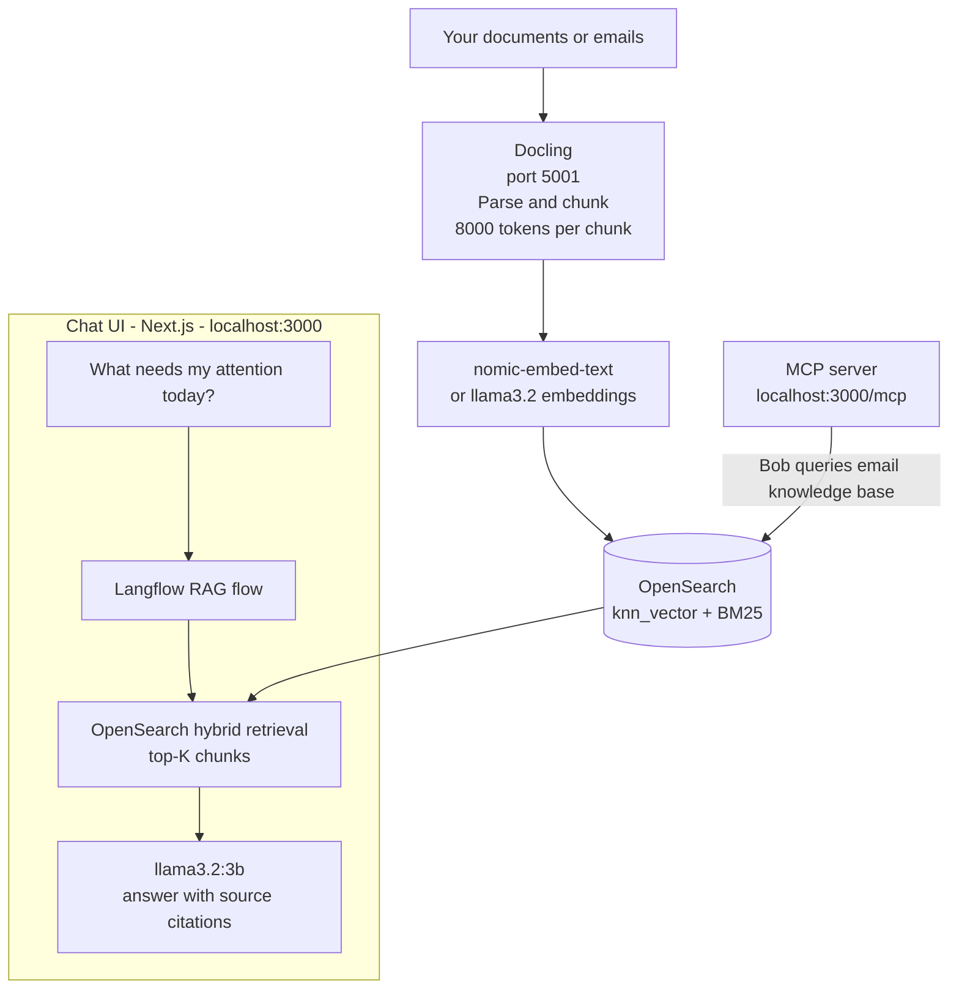
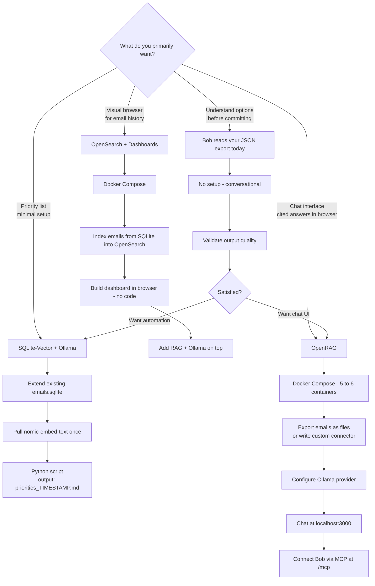
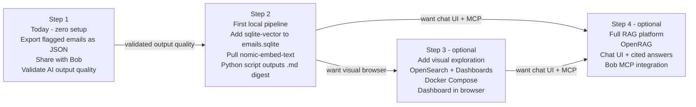

# RAG Solutions Comparison for Outlook Email Task Prioritization

> **Context:** This document compares Retrieval-Augmented Generation (RAG) storage and retrieval
> solutions for building a local, privacy-first AI pipeline on top of the
> **Outlook Folder Extractor** output. The goal is to use a local LLM (Ollama + `llama3.2:3b`)
> to reason over exported emails and produce prioritized task lists.

---

## What is RAG and Why Does It Matter Here?

Without RAG, feeding a large mailbox directly into an LLM hits the context window limit fast —
`llama3.2:3b` cannot process 500 emails at once. RAG solves this by:

1. Converting each email into a vector embedding (a numerical representation of meaning).
2. Storing those vectors in a searchable index.
3. At query time, retrieving only the **top-K most relevant emails** for the question asked.
4. Sending only those K emails to the LLM as context.



---

## The Two Models Always Needed

Regardless of which RAG store you choose, you need **two models**:

| Model | Role | Size | Pull command |
|---|---|---|---|
| `nomic-embed-text` | Converts email text to 768-dim vectors | 274 MB | `ollama pull nomic-embed-text` |
| `llama3.2:3b` | Reasons over retrieved emails, generates priority list | ~2 GB | Already installed |

The embedding model is separate from the reasoning model. Every option below requires both.

---

## Option 1 — Plain SQLite (No RAG)

### What it is
The `emails.sqlite` file produced by the extractor, used directly via SQL queries.
No vector search — filtering is done by SQL (`WHERE`, `LIKE`, date ranges).

### Architecture



### Strengths
- Zero additional setup — already the extractor's output format.
- Incremental by design — idempotent upsert on `message_id`.
- Instant queries on small mailboxes.
- Single file, trivial backup (`cp emails.sqlite backup.sqlite`).

### Limitations
- **No semantic search** — cannot find emails that are "about a deadline" without the word "deadline".
- Keyword search only (`LIKE '%deadline%'`).
- Quality degrades as mailbox grows — full table scans get slower.
- No LLM-assisted retrieval — you must hand-craft SQL filters.

### Best for
Ad-hoc extraction with explicit filters (flagged emails only, specific date range,
known sender). Not suitable for open-ended queries like "what needs my attention today?".

### Resource requirements
| Component | Requirement |
|---|---|
| Disk | Size of `emails.sqlite` only |
| RAM | ~1 MB |
| Extra services | None |

---

## Option 2 — SQLite-Vector (Hybrid RAG)

### What it is
[`sqlite-vector`](https://github.com/sqliteai/sqlite-vector) is a drop-in C extension
for SQLite that adds SIMD-accelerated vector search directly inside the existing
`emails.sqlite` file. Combined with SQLite's built-in FTS5 full-text search, it enables
**hybrid search (semantic + keyword)** with Reciprocal Rank Fusion (RRF) — all in a
single file, no external services.

### Architecture



### Strengths
- **Extends the existing `emails.sqlite`** — no re-indexing from scratch, no new database.
- No external services — everything runs in one file.
- 30 MB RAM footprint for the extension.
- SIMD-accelerated, handles millions of vectors comfortably.
- Hybrid search (vector + FTS5 + RRF) matches OpenSearch quality at mailbox scale.
- Works fully offline, 100% private.
- The [`sqlite-rag`](https://github.com/sqliteai/sqlite-rag) companion project
  provides a ready-made hybrid search CLI on this exact stack.

### Limitations
- Requires loading the `.so` extension at runtime (one-time setup).
- No visual dashboard or browser UI.
- No built-in chat interface — output is a file or terminal.
- Less ecosystem tooling than OpenSearch.

### Best for
**Privacy-first, automated daily digest.** Runs as a cron job or Python script.
Reads new emails from `emails.sqlite`, embeds them, retrieves the most urgent ones,
and outputs `priorities_TIMESTAMP.md`. Ideal first implementation.

### Resource requirements
| Component | Requirement |
|---|---|
| Disk | `emails.sqlite` + ~300 bytes per email for embedding BLOBs |
| RAM | ~30 MB (extension) + model memory |
| Extra services | None |

---

## Option 3 — OpenSearch (Production RAG + Dashboard)

### What it is
[OpenSearch](https://opensearch.org/) is a distributed search and analytics engine
(Apache Lucene under the hood). Its `k-NN` plugin supports HNSW-based approximate
nearest-neighbor vector search, and its BM25 full-text engine enables
**production-grade hybrid search** — the same combination used by OpenRAG and
other enterprise RAG systems.

OpenSearch Dashboards (included) adds a full visual browser at `http://localhost:5601`.

### Architecture



### OpenSearch Dashboards — What You See in the Browser

OpenSearch Dashboards is the visual front-end included with OpenSearch. Once your
emails are indexed, you can build a personal email analytics dashboard without
writing any code — point-and-click only:

| Panel | What it shows |
|---|---|
| **Email timeline** | Bar chart: count of emails received per day/week/month |
| **Top senders** | Pie or bar chart: who sends you the most email by volume |
| **Emails by folder** | Donut chart: distribution across Inbox, flagged, project folders |
| **Discover view** | Searchable, filterable table — like a private Google for your mailbox |
| **Combined dashboard** | All panels on one screen, cross-linked — clicking a sender filters all other panels |

This is separate from the RAG/LLM pipeline — it is a visual exploration tool
that lives on top of the same indexed data.

### Strengths
- Best hybrid search quality (BM25 + HNSW, GigaOm-rated 40–60% better than vector-only).
- Visual dashboard for email exploration and analytics (no code needed).
- Scales to billions of documents.
- Production-grade — used in enterprise search at scale.
- REST API — easy to integrate with any language.

### Limitations
- **4 GB RAM minimum** for a single-node Docker cluster.
- Docker Compose required — always-running service.
- Must re-index emails from SQLite into OpenSearch (separate step).
- JVM-based — heavier startup and resource cost than SQLite options.
- More complex setup than SQLite-Vector.

### Best for
Users who want both a **RAG pipeline AND a visual browser** for their email history.
Also the right choice when the mailbox exceeds tens of thousands of emails and
SQLite-Vector's flat scan starts to slow down.

### Resource requirements
| Component | Requirement |
|---|---|
| Disk | OpenSearch index (~2–5× raw email data size) |
| RAM | 4 GB minimum (OpenSearch JVM heap) |
| Extra services | Docker Compose (OpenSearch + Dashboards containers) |

---

## Option 4 — OpenRAG (Full RAG Platform)

### What it is
[OpenRAG](https://www.openr.ag/) ([GitHub](https://github.com/langflow-ai/openrag))
is IBM's open-source RAG platform (Apache-2.0), built on three components:

| Component | Maintainer | Role |
|---|---|---|
| **Docling** | IBM Research Zurich | Document parsing (PDF, DOCX, HTML, etc.) |
| **OpenSearch** | Linux Foundation | Vector + BM25 hybrid search store |
| **Langflow** | IBM DataStax | Visual drag-and-drop workflow builder |

It ships as a complete, runnable product — not a library. One command gives you:
a chat interface, an ingestion pipeline, a visual workflow editor, source-cited answers,
and a built-in MCP server.

### Architecture



### Langflow Visual Workflow Builder
Langflow provides a drag-and-drop canvas to build and customize the RAG pipeline
without writing code. Pre-built flows included:

| Flow | Purpose |
|---|---|
| OpenRAG OpenSearch Agent | Powers the main chat and RAG loop |
| OpenSearch Ingestion | Processes documents via Docling |
| OpenSearch URL Ingestion | Ingests web pages by URL |
| OpenRAG Nudges | Generates contextual prompt suggestions |

### Ollama Configuration
OpenRAG natively supports Ollama as both LLM and embedding provider:

```bash
EMBEDDING_PROVIDER=ollama
EMBEDDING_MODEL=nomic-embed-text
LLM_PROVIDER=ollama
LLM_MODEL=llama3.2:3b
OLLAMA_ENDPOINT=http://localhost:11434
```

### MCP Server — Connect Bob to Your Email Knowledge Base
OpenRAG ships a built-in MCP server. Once running, Bob (or any MCP-compatible
assistant) can query your email knowledge base directly:

```json
{
  "mcpServers": {
    "openrag": {
      "url": "http://localhost:3000/mcp",
      "headers": { "X-API-Key": "orag_your_api_key" }
    }
  }
}
```

This means you can ask Bob *"What emails need my attention today?"* and Bob queries
your local OpenRAG instance — no file sharing required.

### Strengths
- **Complete product** — chat UI, ingestion, workflow builder, MCP server, all pre-wired.
- Ollama supported natively for both LLM and embeddings.
- Source-cited answers — every response shows which documents were used.
- Visual Langflow workflow builder for customizing the RAG pipeline without code.
- MCP server built-in — integrates with Bob, Cursor, Claude Desktop.
- Multi-model embedding support (A/B test models without re-indexing).
- 4,281 GitHub stars, 50 contributors, active releases (v0.5.1 as of June 2026).
- Apache-2.0 license, IBM-backed.

### Limitations
- **Designed for documents** — Docling is optimized for PDFs/DOCX, not raw email JSON or SQLite rows. Emails need to be exported as files or a custom connector written.
- **Heaviest stack** — OpenSearch + Langflow + Docling + FastAPI + Next.js (~4–6 GB RAM).
- Default LLM provider is OpenAI — Ollama requires explicit configuration.
- Built for document Q&A, not automated scheduled digests — automation requires custom Langflow flows.
- 264 open issues on GitHub — young project, some rough edges.

### Best for
Users who want a **chat interface** to ask natural language questions about their
emails, with cited answers, and optionally connect it to Bob via MCP.
The most powerful and future-proof option on this list.

### Resource requirements
| Component | Requirement |
|---|---|
| Disk | OpenSearch index + Docling models + Langflow state |
| RAM | 4–6 GB (OpenSearch + Langflow + Docling + FastAPI + Next.js) |
| Extra services | Docker Compose (5–6 containers) |

---

## Full Comparison Table

| Dimension | Plain SQLite | SQLite-Vector | OpenSearch | OpenRAG |
|---|---|---|---|---|
| **Search type** | SQL / keyword | Semantic + keyword (FTS5 + vector + RRF) | Semantic + keyword (HNSW + BM25) | Semantic + keyword (HNSW + BM25) |
| **Setup complexity** | Zero | Low (drop-in extension) | Medium (Docker Compose) | High (5–6 containers) |
| **RAM footprint** | ~1 MB | ~30 MB | 4 GB minimum | 4–6 GB |
| **External services** | None | None | Docker (OpenSearch + Dashboards) | Docker (5–6 containers) |
| **Works with existing `emails.sqlite`** | ✅ Native | ✅ Extends it | ❌ Re-index required | ❌ Re-index / custom connector |
| **Ollama integration** | Manual | Manual | Manual | ✅ Native (config only) |
| **Automated digest (cron)** | ✅ Easy | ✅ Easy | ✅ Possible | ⚠️ Requires custom Langflow flow |
| **Chat UI in browser** | ❌ | ❌ | ❌ | ✅ Included |
| **Visual email dashboard** | ❌ | ❌ | ✅ OpenSearch Dashboards | ✅ Via OpenSearch Dashboards |
| **Source-cited answers** | ❌ | Manual | Manual | ✅ Included |
| **MCP server** | ❌ | ❌ | ❌ | ✅ Built-in (`/mcp`) |
| **Visual workflow builder** | ❌ | ❌ | ❌ | ✅ Langflow |
| **Privacy / fully local** | ✅ | ✅ | ✅ | ✅ (Ollama config) |
| **Scales to large mailbox** | ⚠️ | ✅ | ✅ | ✅ |
| **Retrieval quality** | ⭐⭐ | ⭐⭐⭐⭐ | ⭐⭐⭐⭐⭐ | ⭐⭐⭐⭐⭐ |
| **Ease of getting started** | ⭐⭐⭐⭐⭐ | ⭐⭐⭐⭐ | ⭐⭐⭐ | ⭐⭐ |

---

## Decision Guide



---

## Recommended Starting Stack (Incremental Path)

A practical progression that avoids throwaway work — each step builds on the previous:



### Step 1 — Today, zero setup
Export flagged emails as JSON from the extractor. Share the file with Bob.
Validate what AI-prioritized output looks like before investing in infrastructure.

### Step 2 — First local pipeline
Add `sqlite-vector` to the existing `emails.sqlite`. Pull `nomic-embed-text`.
Write a 50-line Python script: embed → retrieve top 10 → ask `llama3.2:3b` → write `.md`.
Run it manually or as a cron job.

### Step 3 — Add visual exploration (optional)
If you want to browse your email history visually, add OpenSearch + Dashboards via
Docker Compose. Index from `emails.sqlite`. Build the dashboard in the browser.

### Step 4 — Upgrade to full RAG platform (optional)
If you want a chat interface with cited answers and MCP integration with Bob,
migrate to OpenRAG. Configure Ollama as the provider. Connect Bob via the `/mcp` endpoint.

---

## Reference Links

| Project | URL |
|---|---|
| Outlook Folder Extractor (this project) | `electron-outlook/` |
| SQLite-Vector | https://github.com/sqliteai/sqlite-vector |
| SQLite-RAG (hybrid search CLI) | https://github.com/sqliteai/sqlite-rag |
| OpenSearch Downloads | https://opensearch.org/downloads/ |
| OpenRAG Website | https://www.openr.ag/ |
| OpenRAG GitHub | https://github.com/langflow-ai/openrag |
| OpenRAG Documentation | https://docs.openr.ag/ |
| Ollama | https://ollama.com/ |
| nomic-embed-text model | `ollama pull nomic-embed-text` |
| llama3.2 model card | https://github.com/meta-llama/llama-models/blob/main/models/llama3_2/MODEL_CARD.md |
