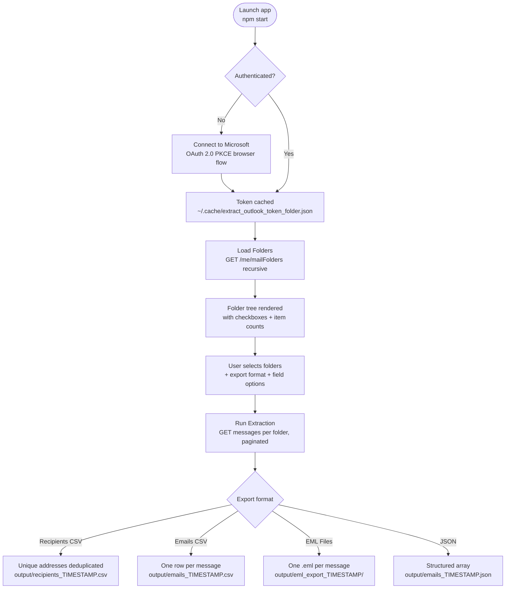

# Outlook Folder Extractor

A native Electron desktop app that connects to your **Microsoft 365 mailbox** via the Graph API (OAuth 2.0 PKCE — no password stored), lets you pick any folders interactively, and exports your emails in your chosen format.

## Architecture



## Export Formats

| Format | Output | Use case |
|---|---|---|
| **Recipients CSV** | Unique email addresses + display names | Build a contacts list |
| **Emails CSV** | One row per message, configurable fields | Spreadsheet analysis |
| **EML Files** | One `.eml` file per message, organised by folder | Archive / import into another mail client |
| **JSON** | Structured array of message objects | Data processing / scripting |

## Field Options (CSV / JSON / EML)

Toggle which fields to include per message:

- **From** · **To / CC** · **Subject** · **Body (plain text)** · **Body (HTML)** · **Attachments metadata**

## Prerequisites

| Tool | Required for | Check |
|---|---|---|
| Node.js 18+ | Build only | `node --version` |
| npm 9+ | Build only | `npm --version` |
| Microsoft 365 account | Always | — |

No Azure App Registration needed — uses Microsoft's public Graph Explorer client by default.

## Quickstart

```bash
# 1. Copy and configure
cp .env.example .env          # optional — defaults work out of the box

# 2. Launch (builds automatically on first run)
cd electron-outlook
npm start
```

See [`electron-outlook/Quickstart.md`](electron-outlook/Quickstart.md) for full details including Windows instructions and troubleshooting.

## Configuration

Copy `.env.example` to `.env` at the project root. All fields are optional — defaults work for most accounts.

| Variable | Default | Description |
|---|---|---|
| `CLIENT_ID` | Graph Explorer public client | Azure App Registration client ID |
| `EXCLUDED_DOMAIN` | `.ibm.com` | Default domain to pre-fill in the "Exclude addresses" field (can be changed in the UI) |
| `REDIRECT_URI` | `http://localhost:8765` | OAuth callback URI (must match Azure registration if using your own) |
| `LOGIN_HINT` | _(empty)_ | Microsoft account email to pre-select at sign-in |

## Output

All exports are written to `electron-outlook/output/` with a timestamp (gitignored).

```
output/recipients_20250625_143022.csv
output/emails_20250625_143022.csv
output/emails_20250625_143022.json
output/eml_export_20250625_143022/
  └── Sent Items/
        └── 2025-06-25T14-30-22_<id>.eml
```

## Scripts

| Script | Purpose |
|---|---|
| `scripts/start-electron-outlook.sh` | Build TypeScript + open desktop window (macOS / Linux) |
| `scripts/stop-electron-outlook.sh` | Stop the app gracefully |
| `scripts/start-electron-outlook.ps1` | Build TypeScript + open desktop window (Windows) |
| `scripts/stop-electron-outlook.ps1` | Stop the app gracefully (Windows) |

## Licence

MIT License — see [LICENSE](LICENSE)

---
*Made with IBM Bob*
