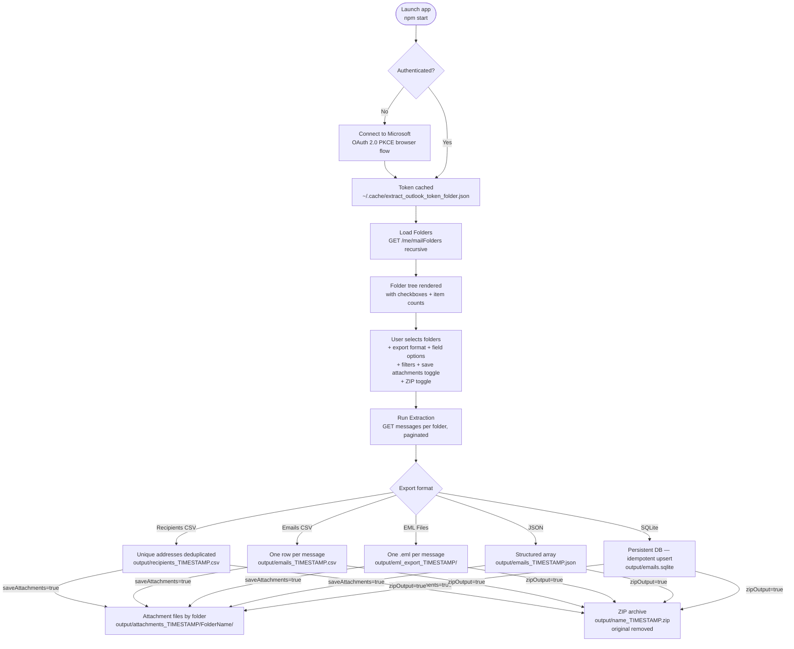

# Outlook Folder Extractor

A native Electron desktop app that connects to your **Microsoft 365 mailbox** via the Graph API (OAuth 2.0 PKCE — no password stored), lets you pick any folders interactively, and exports your emails in your chosen format.

## Architecture



## Export Formats

| Format | Output | Use case |
|---|---|---|
| **Recipients CSV** | Unique email addresses + display names | Build a contacts list |
| **Emails CSV** | One row per message, configurable fields | Spreadsheet analysis |
| **EML Files** | One `.eml` file per message, organised by folder | Archive / import into another mail client |
| **JSON** | Structured array of message objects | Data processing / scripting |
| **SQLite** | Persistent `output/emails.sqlite` — idempotent upsert, re-run safe | Queryable store, incremental syncs |

## Field Options (CSV / JSON / SQLite / EML)

Toggle which fields to include per message:

- **From** · **To / CC** · **Subject** · **Body (plain text)** · **Body (HTML)** · **Attachments metadata**

> Body (plain text) strips HTML tags automatically — Microsoft Graph always returns HTML, so both toggles always produce content regardless of the original email format.

## Filters & Options

| Control | Effect |
|---|---|
| "Exclude addresses containing" | Skips addresses containing the given substring (default: `.ibm.com`) |
| 🚩 "Flagged emails only" | Exports only flagged/follow-up messages; combines with every format |
| 📎 "Also save attachment files to disk" | Saves binary attachment files to `output/attachments_TIMESTAMP/<Folder>/`; combinable with every format; file type filterable (PDF, Word, PowerPoint, Excel, Images) |
| "Scan emails since" | Restricts to messages on or after the chosen date |
| 📦 "Compress output as ZIP file" | Compresses the primary export (file or directory) into a `.zip` archive after export; original is removed |

> All options reset to their defaults on every app launch — no state is remembered between sessions.

## Prerequisites

| Tool | Required for | Check |
|---|---|---|
| Node.js 18+ | Build only | `node --version` |
| npm 9+ | Build only | `npm --version` |
| Microsoft 365 account | Always | — |

No Azure App Registration needed — uses Microsoft's public Graph Explorer client by default.

## Quickstart

```bash
# 1. Copy and configure
cp .env.example .env          # optional — defaults work out of the box

# 2. Launch (builds automatically on first run)
cd electron-outlook
npm start
```

See [`electron-outlook/Quickstart.md`](electron-outlook/Quickstart.md) for full details including Windows instructions and troubleshooting.

## Configuration

Copy `.env.example` to `.env` at the project root. All fields are optional — defaults work for most accounts.

| Variable | Default | Description |
|---|---|---|
| `CLIENT_ID` | Graph Explorer public client | Azure App Registration client ID |
| `EXCLUDED_DOMAIN` | `.ibm.com` | Default domain to pre-fill in the "Exclude addresses" field (can be changed in the UI) |
| `REDIRECT_URI` | `http://localhost:8765` | OAuth callback URI (must match Azure registration if using your own) |
| `LOGIN_HINT` | _(empty)_ | Microsoft account email to pre-select at sign-in |

## Output

All exports are written to `electron-outlook/output/` (gitignored).

```
output/recipients_20250625_143022.csv    ← Recipients CSV (timestamped)
output/emails_20250625_143022.csv        ← Emails CSV (timestamped)
output/emails_20250625_143022.json       ← JSON (timestamped)
output/eml_export_20250625_143022/       ← EML files (timestamped directory)
output/emails.sqlite                     ← SQLite DB (persistent, not timestamped)
output/recipients_20250625_143022.zip    ← ZIP of any of the above (when ZIP option checked)
```

> **ZIP exports:** the `.zip` file is timestamped and the original file/directory is removed after compression. SQLite is an exception — it can be zipped but the `.sqlite` file is recreated on the next non-zip run.
>
> **SQLite:** not timestamped — reused across runs. Records are upserted by `message_id` so re-running never creates duplicates. An `exported_at` column records when each row was last written.
>
> **State reset:** all UI options (format, fields, filters, date, ZIP toggle) are reset to defaults on every app launch.

## Scripts

| Script | Purpose |
|---|---|
| `scripts/start-electron-outlook.sh` | Build TypeScript + open desktop window (macOS / Linux) |
| `scripts/stop-electron-outlook.sh` | Stop the app gracefully |
| `scripts/start-electron-outlook.ps1` | Build TypeScript + open desktop window (Windows) |
| `scripts/stop-electron-outlook.ps1` | Stop the app gracefully (Windows) |

## Licence

MIT License — see [LICENSE](LICENSE)

---
*Made with IBM Bob*
