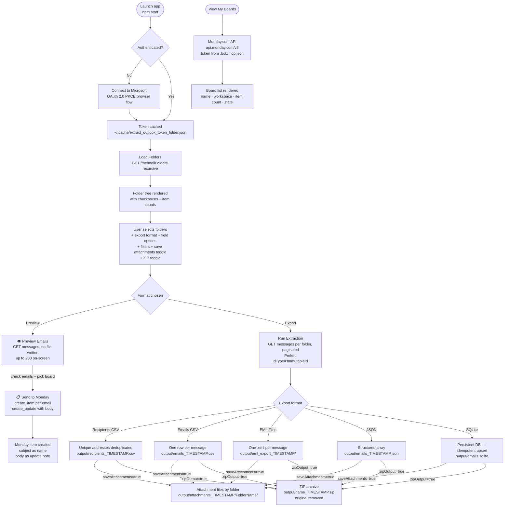
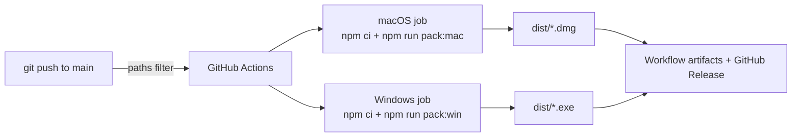

# Outlook Folder Extractor

A native Electron desktop app that connects to your **Microsoft 365 mailbox** via the Graph API (OAuth 2.0 PKCE — no password stored), lets you pick any folders interactively, and exports your emails in your chosen format. The app also integrates with **Monday.com** — you can browse your boards directly from the app sidebar using your Monday API token.

## Architecture



## Export Formats

| Format | Output | Use case |
|---|---|---|
| **Recipients CSV** | Unique email addresses + display names | Build a contacts list |
| **Emails CSV** | One row per message, configurable fields, plus Outlook identifiers | Spreadsheet analysis with reopen metadata |
| **EML Files** | One `.eml` file per message, organised by folder, with export headers | Archive / import into another mail client |
| **JSON** | Structured array of message objects, plus Outlook identifiers | Data processing / scripting |
| **SQLite** | Persistent `output/emails.sqlite` — idempotent upsert, re-run safe, with Outlook identifiers | Queryable store, incremental syncs |
| **Preview** | No file written — emails shown on-screen with reading pane + live search | Browse & search messages without exporting |

## Field Options (CSV / JSON / SQLite / EML)

Toggle which fields to include per message:

- **From** · **To / CC** · **Subject** · **Body (plain text)** · **Body (HTML)** · **Attachments metadata**

> Body (plain text) strips HTML tags automatically — Microsoft Graph always returns HTML, so both toggles always produce content regardless of the original email format.

## Monday.com Integration

The app includes a **Monday.com Boards** card at the bottom of the window. Click **📋 View My Boards** to fetch and display all your Monday boards without leaving the app.

| Field shown | Source |
|---|---|
| Board name | Monday GraphQL `boards.name` |
| Workspace | `boards.workspace.name` |
| Item count | `boards.items_count` |
| Status badge | `boards.state` (Active / other) |
| Kind icon | 🌐 public · 🔒 private · 🔗 share |
| **Board ID** | `boards.id` — shown in the meta line for use in EML Triage |

**Token configuration:** the app reads the Monday API token automatically from workspace-root `.bob/mcp.json` (the same token used by the Monday MCP server), or falls back to workspace-root `.env` via `MONDAY_API_TOKEN`. This works with both launcher scripts and manual `npm start`.

> If the token is not found or is invalid, an error message is shown inline in the card.

### Email → Monday (Send to Monday)

Emails browsed in **Preview** mode can be pushed directly to a Monday board as items.

**How it works:**
1. Load boards by clicking **📋 View My Boards** — this also populates the board picker in the email selection bar.
2. Switch to **Preview** format and load emails.
3. Tick one or more email checkboxes — the selection bar appears.
4. Pick the target board from the **board dropdown** in the selection bar.
5. Click **📋 Send to Monday**.

For each selected email the app:
- Creates a Monday item with the **email subject** as the item name (`create_item` mutation)
- Posts the **full email body** (plain text) as an item update note (`create_update` mutation)

| Email field | Monday destination |
|---|---|
| Subject | Item name |
| Body (plain text) | Item update / note |

The selection bar shows a live status:
- 🔵 `Sending N email(s) to Monday…` while in progress
- ✅ `N item(s) created on "<BoardName>"` on success
- ❌ Error details if any items fail (loop continues for remaining emails)

## Filters & Options

| Control | Effect |
|---|---|
| "Exclude addresses containing" | Skips addresses containing the given substring (default: `.ibm.com`) |
| 🚩 "Flagged emails only" | Filters flagged/follow-up messages; applies to Preview and all export formats |
| 📎 "Also save attachment files to disk" | Saves binary attachment files to `output/attachments_TIMESTAMP/<Folder>/`; combinable with every export format; file type filterable (PDF, Word, PowerPoint, Excel, Images) |
| "Scan emails since" | Restricts to messages on or after the chosen date; applies to Preview and all export formats |
| 📦 "Compress output as ZIP file" | Compresses the primary export into a `.zip` archive; original is removed (hidden in Preview mode) |
| "👁 Load up to N emails" | Preview mode only — caps messages fetched for on-screen display (50 / 100 / 200) |

> All options reset to their defaults on every app launch — no state is remembered between sessions.

## Prerequisites

| Tool | Required for | Check |
|---|---|---|
| Node.js 18+ | Build only | `node --version` |
| npm 9+ | Build only | `npm --version` |
| Microsoft 365 account | Always | — |
| Monday.com account | Monday Boards feature only | — |

No Azure App Registration needed — uses Microsoft's public Graph Explorer client by default.

The Monday.com integration requires a valid API token in workspace-root `.bob/mcp.json`, or `MONDAY_API_TOKEN` in workspace-root `.env`. If the Monday MCP server is already configured, no extra steps are needed.

## Quickstart

For a complete beginner-friendly guide, see [`Docs/Quickstart.md`](Docs/Quickstart.md).

### 1. Clone the repository

Open a terminal window, go to the folder where you want to download the project, and then run:

```bash
git clone <repository-url>
cd Outlook-Bob
pwd
ls
```

### 2. Configure (optional)

```bash
cp .env.example .env
```

### 3. Launch from the project root

The launcher scripts read Monday credentials from workspace-root `.bob/mcp.json` and `.env`, matching the behaviour of manual `npm start`.

**macOS / Linux:**
```bash
bash scripts/start-electron-outlook.sh
```

**Windows (PowerShell):**
```powershell
powershell -ExecutionPolicy Bypass -File scripts\start-electron-outlook.ps1
```

On the first source-based launch, the project also creates a desktop launcher for the current user:
- macOS: `~/Desktop/Outlook Folder Extractor.command`
- Windows: Desktop shortcut `Outlook Folder Extractor.lnk`

### 4. Manual launch alternative

```bash
cd electron-outlook
npm install
npm start
```

### 5. Packaging outputs

Installer and packaging commands write their output to the [`electron-outlook/dist/`](electron-outlook/dist) folder.

Common commands:
- [`npm run build`](electron-outlook/package.json:7) compiles TypeScript into [`electron-outlook/dist/`](electron-outlook/dist) runtime files
- [`npm run pack:mac`](electron-outlook/package.json:10) creates macOS installer output such as a `.dmg`
- [`npm run pack:win`](electron-outlook/package.json:11) creates Windows installer output such as an NSIS `.exe`

When the app starts successfully, the **Outlook Folder Extractor** desktop window opens and you can click **Connect to Microsoft**.

See [`electron-outlook/Quickstart.md`](electron-outlook/Quickstart.md) and [`Docs/Quickstart.md`](Docs/Quickstart.md) for full details including troubleshooting.

## Configuration

Copy `.env.example` to `.env` at the project root. All fields are optional — defaults work for most accounts.

| Variable | Default | Description |
|---|---|---|
| `CLIENT_ID` | Graph Explorer public client | Azure App Registration client ID |
| `EXCLUDED_DOMAIN` | `.ibm.com` | Default domain to pre-fill in the "Exclude addresses" field (can be changed in the UI) |
| `REDIRECT_URI` | `http://localhost:8765` | OAuth callback URI (must match Azure registration if using your own) |
| `LOGIN_HINT` | _(empty)_ | Microsoft account email to pre-select at sign-in |
| `BOX_TOKEN` | _(empty)_ | Box Developer Token — required to enable Box upload destination |

## Cloud Upload — Box Drive, Box API & OneDrive

The **Output Destination** card lets you choose where extraction output is saved:

| Selection | Behaviour |
|---|---|
| 💻 **Local** | Saved to workspace-root `output/` only (default) |
| 📦 **Box Drive** | Copied to your locally-mounted Box Drive folder |
| ☁️ **Box API** | Uploaded to IBM Enterprise Box via API |
| 🔵 **OneDrive** | Uploaded to your OneDrive only |
| 💻+📦 **Both (Box Drive)** | Saved locally AND copied to Box Drive |
| 💻+☁️ **Both (Box API)** | Saved locally AND uploaded to Box |
| 💻+🔵 **Both (OneDrive)** | Saved locally AND uploaded to OneDrive |

---

## Box Drive Integration

Box Drive is installed locally on your Mac and mounts your Box account at:
```
~/Library/CloudStorage/Box-Box/
```
No OAuth, no API key — the app uses a plain `fs.copyFile` under the hood.

### How it works

When **📦 Box Drive** or **💻+📦 Both (Box Drive)** is selected:
- The app auto-detects the Box Drive mount path on selection
- Click **🔄 Detect** to re-check if Box Drive was not found
- Click **📂 Load Folders** to list top-level folders inside Box Drive
- Select an existing folder, **or** type a new sub-folder name to create one
- After extraction, the file is copied: `📦 Copied to Box Drive: <path>`

> Box Drive must be installed and signed in on your Mac. Download from [box.com/drive](https://www.box.com/drive).

---

## Box API Integration

The app can upload extraction output directly to an **IBM Enterprise Box** (`ibm.ent.box.com`) folder.

### Setup

1. Go to [ibm.ent.box.com/developers/console](https://ibm.ent.box.com/developers/console) → create a **Custom App** → **User Authentication (OAuth 2.0)**
2. Set Redirect URI to `http://localhost:8766`
3. Add credentials to `.env`:
   ```
   BOX_CLIENT_ID=your_client_id
   BOX_CLIENT_SECRET=your_client_secret
   BOX_REDIRECT_URI=http://localhost:8766
   ```
4. Ask your IBM Box admin to **enable** the app in Admin Console → Apps → Custom Apps Manager

> Once enabled, click **Connect to Box** in the app — your browser opens IBM Box login (w3id).
> The token is cached and auto-refreshed. A pending notice is shown in the UI until the admin approves.

### How it works

When **☁️ Box** or **💻+☁️ Both (Box)** is selected:
- Click **📂 Load Box Folders** to fetch your root-level Box folders
- Select an existing folder, **or** type a new folder name to create one
- After extraction, the file is uploaded automatically: `☁️ Uploaded to Box: <filename>`

---

## OneDrive Integration

OneDrive upload reuses the **existing Microsoft token** — no extra setup or credentials needed.

### How it works

When **🔵 OneDrive** or **💻+🔵 Both (OneDrive)** is selected:
- Connect to Microsoft first (the standard **Connect to Microsoft** button)
- Click **📂 Load OneDrive Folders** to fetch your root-level OneDrive folders
- Select an existing folder, **or** type a new folder name to create one
- After extraction, the file is uploaded: `🔵 Uploaded to OneDrive: <filename>`

Supports files up to 4 MB via simple upload, and larger files via resumable chunked upload automatically.

### Monday.com token (`.bob/mcp.json` or `.env`)

The Monday API token is read from `.bob/mcp.json` at the workspace root — the same file used by the Monday MCP server in Bob. If that file does not provide a token, the app falls back to `MONDAY_API_TOKEN` from workspace-root `.env`.

```json
{
  "mcpServers": {
    "monday": {
      "type": "sse",
      "url": "https://mcp.monday.com/sse",
      "headers": {
        "Authorization": "<your-monday-api-token>"
      }
    }
  }
}
```

The app searches these config files across the supported source and launcher layouts so both [`scripts/start-electron-outlook.sh`](scripts/start-electron-outlook.sh), [`scripts/start-electron-outlook.ps1`](scripts/start-electron-outlook.ps1), and manual [`npm start`](electron-outlook/package.json:8) resolve the same token. If the token is absent from both sources, the **View My Boards** button shows an error and no data is fetched.

## Output

All exports are written to the workspace-root `output/` folder (gitignored).

For every message-based export except Recipients CSV, the app now writes a stable export identifier plus Outlook-specific reopen metadata where Microsoft Graph provides it:

- `exportId` — SHA-256 of the immutable Graph message ID + `internetMessageId`
- `messageId` — Graph message ID requested with `Prefer: IdType="ImmutableId"`
- `internetMessageId` — SMTP `Message-ID` header value
- `outlookWebLink` — Outlook on the web link returned by Microsoft Graph

These fields help correlate records across CSV, JSON, EML, and SQLite exports. They improve Outlook Web reopening, but desktop Outlook deep-linking is still environment-dependent and is not guaranteed by the export alone.

```
output/recipients_20250625_143022.csv    ← Recipients CSV (timestamped)
output/emails_20250625_143022.csv        ← Emails CSV (timestamped)
output/emails_20250625_143022.json       ← JSON (timestamped)
output/eml_export_20250625_143022/       ← EML files (timestamped directory)
output/emails.sqlite                     ← SQLite DB (persistent, not timestamped)
output/recipients_20250625_143022.zip    ← ZIP of any of the above (when ZIP option checked)
```

> **ZIP exports:** the `.zip` file is timestamped and the original file/directory is removed after compression. SQLite is an exception — it can be zipped but the `.sqlite` file is recreated on the next non-zip run.
>
> **SQLite:** not timestamped — reused across runs. Records are upserted by `message_id` so re-running never creates duplicates. An `exported_at` column records when each row was last written.
>
> **State reset:** all UI options (format, fields, filters, date, ZIP toggle) are reset to defaults on every app launch.

## CI / CD — Automated builds

Every push to `main` that modifies the Electron source automatically triggers the GitHub Actions workflow [`.github/workflows/build-mac.yml`](.github/workflows/build-mac.yml), which now builds both macOS and Windows installers.

1. Compiles TypeScript
2. Packages a macOS `arm64` `.dmg` via `electron-builder`
3. Packages a Windows `.exe` installer via `electron-builder`
4. Uploads both installer outputs as workflow artifacts (kept 30 days)
5. Creates a GitHub pre-release tagged `build-<short-sha>` with both installers attached



**Triggered by changes to:**
- `electron-outlook/src/**`
- [`electron-outlook/package.json`](electron-outlook/package.json) · [`electron-outlook/package-lock.json`](electron-outlook/package-lock.json) · [`electron-outlook/tsconfig.json`](electron-outlook/tsconfig.json)
- [`.github/workflows/build-mac.yml`](.github/workflows/build-mac.yml)

**Download the latest build:**
Go to the [**Releases**](../../releases) tab and download the `.dmg` for macOS and/or the `.exe` installer for Windows from the most recent `build-*` pre-release.

## EML → Monday Triage

Exported `.eml` files can be triaged in two ways — directly from the app UI, or via the Bob Agent workflow.

### Option A — Built-in App Card (no Bob required)

The **EML → Monday Triage** card (bottom of the app window) handles everything inside the app:

1. Click **📁 EML folder** → browse to your `.eml` export directory
2. Optionally click **📄 Prompt file** → select a `.md` or `.txt` prompt file. If left empty, the app uses [`.bob/skills/eml-to-monday.md`](.bob/skills/eml-to-monday.md)
3. Enter your **🏷️ Board ID** (copy from the Monday Boards list — shown as `ID: …` per row)
4. Click **▶ Run Triage** — the app processes every `.eml` file:
   - Parses headers (subject, sender, date) and strips HTML body to plain text
   - Infers urgency (🔴/🟡/🟢) and category from subject/body keywords
   - Creates a Monday item (subject → item name)
   - Posts a formatted note (sender · date · urgency · category · summary)
   - Moves each processed file to `<folder>/processed/`
5. Live progress log and results table show item IDs and any errors
6. Failed files remain in the source folder — safe to retry

### Option B — Bob Agent workflow (AI-powered extraction)

Exported `.eml` files can be processed by **Bob** (AI agent) using a local prompt file,
creating a Monday.com item per email and moving each processed file to a `processed/`
subfolder — no extra credentials needed beyond the existing Monday token in `.bob/mcp.json`.

### How it works

1. Run the pre-flight helper to validate inputs and list files:
   ```bash
   bash scripts/process-eml-to-monday.sh \
     --folder  output/eml_export_TIMESTAMP/ \
     --prompt  prompts/email-triage.md \
     --board   <your-monday-board-id>
   ```
2. The script prints a ready-to-paste instruction for Bob.
3. Paste it into Bob (Agent mode) — Bob reads each `.eml`, applies your prompt,
   calls Monday, and moves the file to `processed/`.

### Prompt file

The prompt file lives in the `prompts/` folder (gitignored — stays local):

| File | Purpose |
|---|---|
| `prompts/email-triage.md` | Default template — extracts sender, date, urgency, category, summary, action items |

Edit `prompts/email-triage.md` to customise what is extracted and how the Monday note is formatted.

### What Bob creates in Monday

| Email field | Monday destination |
|---|---|
| Subject | Item name (`create_item`) |
| Sender · Date · Urgency · Category · Summary · Action items | Formatted update note (`create_update`) |

### File movement

| File state | Location |
|---|---|
| Waiting to be processed | `<eml_folder>/` |
| Successfully sent to Monday | `<eml_folder>/processed/` |
| Failed (Monday API error) | Stays in `<eml_folder>/` for retry |

---

## Scripts

| Script | Purpose |
|---|---|
| `scripts/start-electron-outlook.sh` | Build TypeScript + open desktop window (macOS / Linux); reads Monday credentials from workspace-root `.bob/mcp.json` / `.env` |
| `scripts/stop-electron-outlook.sh` | Stop the app gracefully |
| `scripts/start-electron-outlook.ps1` | Build TypeScript + open desktop window (Windows); reads Monday credentials from workspace-root `.bob/mcp.json` / `.env` |
| `scripts/stop-electron-outlook.ps1` | Stop the app gracefully (Windows) |
| `scripts/process-eml-to-monday.sh` | Pre-flight check for EML → Monday triage — Bob Agent workflow (macOS / Linux) |
| `scripts/github-push.sh` | Convenience script to commit and push changes to GitHub |

## Licence

MIT License — see [LICENSE](LICENSE)

---
*Made with IBM Bob*
