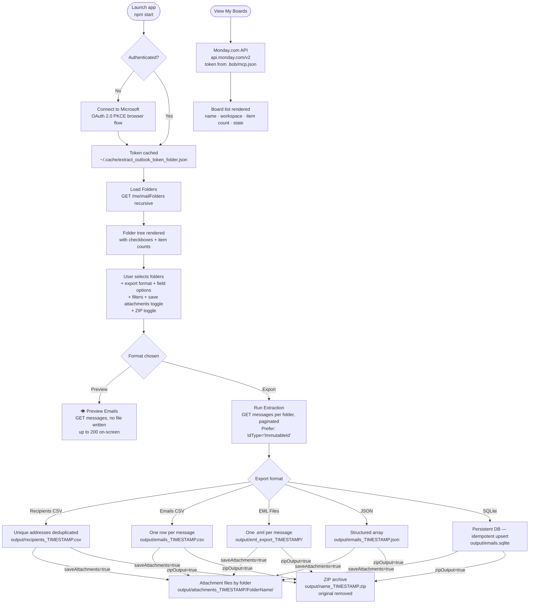
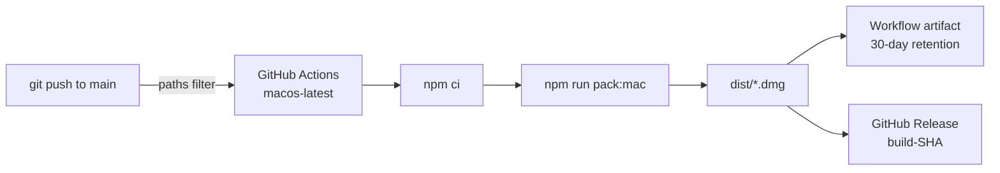

# Outlook Folder Extractor

A native Electron desktop app that connects to your **Microsoft 365 mailbox** via the Graph API (OAuth 2.0 PKCE — no password stored), lets you pick any folders interactively, and exports your emails in your chosen format. The app also integrates with **Monday.com** — you can browse your boards directly from the app sidebar using your Monday API token.

## Architecture



## Export Formats

| Format | Output | Use case |
|---|---|---|
| **Recipients CSV** | Unique email addresses + display names | Build a contacts list |
| **Emails CSV** | One row per message, configurable fields, plus Outlook identifiers | Spreadsheet analysis with reopen metadata |
| **EML Files** | One `.eml` file per message, organised by folder, with export headers | Archive / import into another mail client |
| **JSON** | Structured array of message objects, plus Outlook identifiers | Data processing / scripting |
| **SQLite** | Persistent `output/emails.sqlite` — idempotent upsert, re-run safe, with Outlook identifiers | Queryable store, incremental syncs |
| **Preview** | No file written — emails shown on-screen with reading pane + live search | Browse & search messages without exporting |

## Field Options (CSV / JSON / SQLite / EML)

Toggle which fields to include per message:

- **From** · **To / CC** · **Subject** · **Body (plain text)** · **Body (HTML)** · **Attachments metadata**

> Body (plain text) strips HTML tags automatically — Microsoft Graph always returns HTML, so both toggles always produce content regardless of the original email format.

## Monday.com Integration

The app includes a **Monday.com Boards** card at the bottom of the window. Click **📋 View My Boards** to fetch and display all your Monday boards without leaving the app.

| Field shown | Source |
|---|---|
| Board name | Monday GraphQL `boards.name` |
| Workspace | `boards.workspace.name` |
| Item count | `boards.items_count` |
| Status badge | `boards.state` (Active / other) |
| Kind icon | 🌐 public · 🔒 private · 🔗 share |

**Token configuration:** the app reads the Monday API token automatically from `.bob/mcp.json` (the same token used by the Monday MCP server). No additional setup is needed if the MCP is already configured.

> If the token is not found or is invalid, an error message is shown inline in the card.

## Filters & Options

| Control | Effect |
|---|---|
| "Exclude addresses containing" | Skips addresses containing the given substring (default: `.ibm.com`) |
| 🚩 "Flagged emails only" | Filters flagged/follow-up messages; applies to Preview and all export formats |
| 📎 "Also save attachment files to disk" | Saves binary attachment files to `output/attachments_TIMESTAMP/<Folder>/`; combinable with every export format; file type filterable (PDF, Word, PowerPoint, Excel, Images) |
| "Scan emails since" | Restricts to messages on or after the chosen date; applies to Preview and all export formats |
| 📦 "Compress output as ZIP file" | Compresses the primary export into a `.zip` archive; original is removed (hidden in Preview mode) |
| "👁 Load up to N emails" | Preview mode only — caps messages fetched for on-screen display (50 / 100 / 200) |

> All options reset to their defaults on every app launch — no state is remembered between sessions.

## Prerequisites

| Tool | Required for | Check |
|---|---|---|
| Node.js 18+ | Build only | `node --version` |
| npm 9+ | Build only | `npm --version` |
| Microsoft 365 account | Always | — |
| Monday.com account | Monday Boards feature only | — |

No Azure App Registration needed — uses Microsoft's public Graph Explorer client by default.

The Monday.com integration requires a valid API token in `.bob/mcp.json`. If the Monday MCP server is already configured, no extra steps are needed.

## Quickstart

For a complete beginner-friendly guide, see [`Docs/Quickstart.md`](Docs/Quickstart.md).

### 1. Clone the repository

Open a terminal window, go to the folder where you want to download the project, and then run:

```bash
git clone <repository-url>
cd Outlook-Bob
pwd
ls
```

### 2. Configure (optional)

```bash
cp .env.example .env
```

### 3. Launch from the project root

**macOS / Linux:**
```bash
bash scripts/start-electron-outlook.sh
```

**Windows (PowerShell):**
```powershell
powershell -ExecutionPolicy Bypass -File scripts\start-electron-outlook.ps1
```

On the first source-based launch, the project also creates a desktop launcher for the current user:
- macOS: `~/Desktop/Outlook Folder Extractor.command`
- Windows: Desktop shortcut `Outlook Folder Extractor.lnk`

### 4. Manual launch alternative

```bash
cd electron-outlook
npm install
npm start
```

### 5. Packaging outputs

Installer and packaging commands write their output to the [`electron-outlook/dist/`](electron-outlook/dist) folder.

Common commands:
- [`npm run build`](electron-outlook/package.json:7) compiles TypeScript into [`electron-outlook/dist/`](electron-outlook/dist) runtime files
- [`npm run pack:mac`](electron-outlook/package.json:10) creates macOS installer output such as a `.dmg`
- [`npm run pack:win`](electron-outlook/package.json:11) creates Windows installer output such as an NSIS `.exe`

When the app starts successfully, the **Outlook Folder Extractor** desktop window opens and you can click **Connect to Microsoft**.

See [`electron-outlook/Quickstart.md`](electron-outlook/Quickstart.md) and [`Docs/Quickstart.md`](Docs/Quickstart.md) for full details including troubleshooting.

## Configuration

Copy `.env.example` to `.env` at the project root. All fields are optional — defaults work for most accounts.

| Variable | Default | Description |
|---|---|---|
| `CLIENT_ID` | Graph Explorer public client | Azure App Registration client ID |
| `EXCLUDED_DOMAIN` | `.ibm.com` | Default domain to pre-fill in the "Exclude addresses" field (can be changed in the UI) |
| `REDIRECT_URI` | `http://localhost:8765` | OAuth callback URI (must match Azure registration if using your own) |
| `LOGIN_HINT` | _(empty)_ | Microsoft account email to pre-select at sign-in |

### Monday.com token (`.bob/mcp.json`)

The Monday API token is read from `.bob/mcp.json` at the project root — the same file used by the Monday MCP server in Bob:

```json
{
  "mcpServers": {
    "monday": {
      "type": "sse",
      "url": "https://mcp.monday.com/sse",
      "headers": {
        "Authorization": "<your-monday-api-token>"
      }
    }
  }
}
```

The app searches for this file relative to its runtime location. If the token is absent or the file does not exist, the **View My Boards** button shows an error and no data is fetched.

## Output

All exports are written to `electron-outlook/output/` (gitignored).

For every message-based export except Recipients CSV, the app now writes a stable export identifier plus Outlook-specific reopen metadata where Microsoft Graph provides it:

- `exportId` — SHA-256 of the immutable Graph message ID + `internetMessageId`
- `messageId` — Graph message ID requested with `Prefer: IdType="ImmutableId"`
- `internetMessageId` — SMTP `Message-ID` header value
- `outlookWebLink` — Outlook on the web link returned by Microsoft Graph

These fields help correlate records across CSV, JSON, EML, and SQLite exports. They improve Outlook Web reopening, but desktop Outlook deep-linking is still environment-dependent and is not guaranteed by the export alone.

```
output/recipients_20250625_143022.csv    ← Recipients CSV (timestamped)
output/emails_20250625_143022.csv        ← Emails CSV (timestamped)
output/emails_20250625_143022.json       ← JSON (timestamped)
output/eml_export_20250625_143022/       ← EML files (timestamped directory)
output/emails.sqlite                     ← SQLite DB (persistent, not timestamped)
output/recipients_20250625_143022.zip    ← ZIP of any of the above (when ZIP option checked)
```

> **ZIP exports:** the `.zip` file is timestamped and the original file/directory is removed after compression. SQLite is an exception — it can be zipped but the `.sqlite` file is recreated on the next non-zip run.
>
> **SQLite:** not timestamped — reused across runs. Records are upserted by `message_id` so re-running never creates duplicates. An `exported_at` column records when each row was last written.
>
> **State reset:** all UI options (format, fields, filters, date, ZIP toggle) are reset to defaults on every app launch.

## CI / CD — Automated builds

Every push to `main` that modifies the Electron source automatically triggers a GitHub Actions workflow ([`.github/workflows/build-mac.yml`](.github/workflows/build-mac.yml)) that:

1. Compiles TypeScript
2. Packages a macOS `arm64` `.app` + `.dmg` via `electron-builder`
3. Uploads the `.dmg` as a **workflow artifact** (kept 30 days)
4. Creates a **GitHub Release** pre-tagged `build-<short-sha>` with the `.dmg` attached



**Triggered by changes to:**
- `electron-outlook/src/**`
- `electron-outlook/package.json` · `package-lock.json` · `tsconfig.json`
- `.github/workflows/build-mac.yml`

**Download the latest build:**
Go to the [**Releases**](../../releases) tab and download the `.dmg` from the most recent `build-*` pre-release.

## Scripts

| Script | Purpose |
|---|---|
| `scripts/start-electron-outlook.sh` | Build TypeScript + open desktop window (macOS / Linux) |
| `scripts/stop-electron-outlook.sh` | Stop the app gracefully |
| `scripts/start-electron-outlook.ps1` | Build TypeScript + open desktop window (Windows) |
| `scripts/stop-electron-outlook.ps1` | Stop the app gracefully (Windows) |

## Licence

MIT License — see [LICENSE](LICENSE)

---
*Made with IBM Bob*
